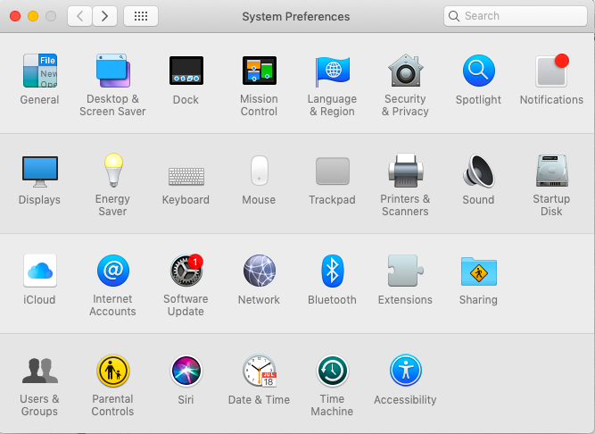
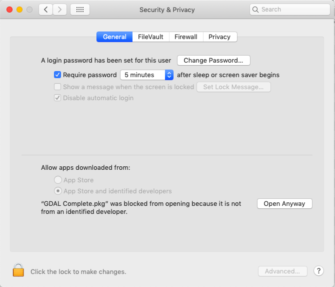
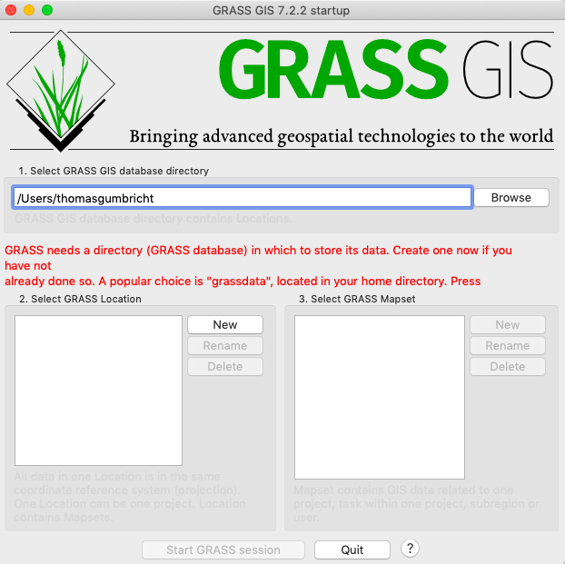

<script src="https://karttur.github.io/common/assets/js/karttur/togglediv.js"></script>
**Contents**
	\- [Geospatial data processing engines](#geospatial-data-processing-engines)
	\- [Installations](#installations)
		\- [GDAL](#gdal)
		\- [QGIS](#qgis)
		\- [GRASS](#grass)
	\- [Resources](#resources)

## Geospatial data processing engines
Working with geospatial data requires a Geographic Information System (GIS). There are several commercial packages available, but I only use Open Source (OS) GIS. The Open Source Geospatial Foundation [OSGeo](http://www.osgeo.org) site contains a lot of OS alternatives.

Most of my Geo Imagine processing I do using Python and the Geospatial Data Abstraction Library [(GDAL)](http://www.gdal.org). For specific tasks I use Geographic Resources Analysis Support System [(GRASS)](https://grass.osgeo.org) and for viewing maps, setting colors and creating map layouts I use Quantum GIS [(QGIS)](https://www.qgis.org/en/site/). QGIS actually contains GRASS, and if you prefer a graphical user interface (GUI) you can use GRASS under QGIS. That is, however, not covered in this blog; it is covered in the QGIS manual [Module: GRASS](https://docs.qgis.org/3.4/en/docs/training_manual/grass/index.html).

## Installations

Working with GDAL, QGIS and GRASS on Mac OS X is not more complex compared to other operating systems. To get the components setup and working together, might, however, be a bit more complex. Historically, William Kyngesburye ([KyngChaos page](http://www.kyngchaos.com/)) has maintained installers and instructions. But then QGIS set up their own installer for some versions, and then returned to letting William Kyngesburye do it. You just have to check out and read the instructions both on the official [QGIS](https://www.qgis.org) site and at [KyngChaos](http://www.kyngchaos.com/) to make sure how to do at this point in time (when you read this).

### GDAL

If you intend to install both GDAL and QGIS on a mac, first check out if the QGIS installer maintained by William Kyngesburye ([KyngChaos page](http://www.kyngchaos.com/software:frameworks)) also contains the complete GDAL package. If so, you can skip installing GDAL separately and jump directly to the QGIS installation. Otherwise install GDAL from ([KyngChaos](http://www.kyngchaos.com/software:frameworks)). If you are installing a stand alone binary version of GRASS below, you might need several versions of GDAL. There is no problem installing parallel versions of GDAl.

[GDAL](http://www.gdal.org) is a powerful translator library for creating, modifying and managing geospatial data, and is also at the core of many commercial GIS software packages. GDAL can be downloaded via links on the [GDAL official homepage](http://www.gdal.org). Here I will only cover how to install GDAL on macOS.

GDAL is dependent on several frameworks, including:
* PROJ
* UnixImageIO
* GEOS
* SQLite3

The GDAL convenience installer offered on the [KyngChaos page](http://www.kyngchaos.com/software:frameworks) includes all the necessary frameworks (and is, or was, also the official installation site for GDAL on macOS). Go ahead and download the convenience installer for the latest version of GDAL (2.4 when updating in August 2019). The installer comes as a diskimage (.dmg). Open it by double clicking. The diskimage contains two package installer (<span class='file'>.pkg</span>) and several ReadMe files in Rich Textformat (<span class='file'>.rtf</span>). The installer <span class='file'>GDAL Complete.pkg</span>, installs both GDAL and the necessary dependencies.

Go ahead and install the complete GDAL package by double clicking <span class='file'>GDAL Complete.pkg</span>. You will most likely be denied installing GDAL due to the macOS security settings. To allow installation, go via the mac main menu, click the apple (absolute top left of the computer screen), select <span class='finder'>System Preferences...</span>.

<figure>

<figcaption> Mac OSX System Preferences window, Security and Privacy is in the top row.
</figcaption>
</figure>

In the top row of the <span class='tab'>System Preferences</span> window (see figure above), click the Security & Privacy icon. In the window that open, under the <span class='tab'>General</span> tab (usually in front by default), you should see a paragraph towards the bottom:

<figure>

<figcaption> Mac OSX Security & Privacy window, requiring that you allow installing download from unidentified developer.
</figcaption>
</figure>

```
"GDAL Complete.pkg" was blocked from opening...
```
Click the button <span class='button'>Open Anyway</span>, and try to install again. The installation should come one step further, but you still have to confirm that you want to to go ahead with the installation in a pop-up window. The <span class='file'>.pkg</span> installer will guide you through the installation. Finally you have to give your user password, and the package will install.

You should also install the <span class='file'>NumPy.pkg</span> available on the GDAl Complete diskimage. You have to follow the same procedure with bypassing the macOS security settings.

If you intend to install GRASS as a stand alone package (GRASS is otherwise included in QGIS), also download and install GDAL 1.11. No need to re-install the <span class='file'>NumPy.pkg</span> if you did that while installing the later GDAL version.

On macOS, GDAL and its dependencies are installed in the Frameworks Library:

<span class="finder">/Library/Frameworks</span>

If you want to have access to GDAL without specifying the full path, add the path in the system file <span class='file'>.bash_profile</span> under your user. To do that, open a Terminal window and make sure you are in your home directory by printing pwd (print working directory) at the prompt:

<span class="terminal">$ pwd</span>

You should then get a tilde(~) followed by your username in return.

<span class="terminal">Computername:~ youruser$</span>

If you are not in your home directory, execute the following command at the Terminal prompt:

<span class="terminal">$ cd ~</span>

You can add the path directly by writing at the command line, or by editing the file <span class='file'>.bash_profile</span>. I prefer editing the file, as I can then comment what I have done. As you are about the edit a system file, you have to use the command sudo (superuser do or substitute user do) together with a text editor. I use the very basic <span class='app'>Terminal</span> text editor <span class='terminalapp'>pico</span>, and the command for opening <span class='file'>.bash_profile</span> in edit mode thus becomes:

<span class="terminal">$ sudo pico .bash_profile</span>

If you already installed Anaconda as described in [this blog post](../2017/2917-12-26-setting-uo-anaconda.html) you will see that the PATH to Anaconda is already given in <span class='file'>.bash_profile</span>. Now you need to add the path to GDAL, **below** any other PATHS already given.

<span class="terminal">PATH=/Library/Frameworks/GDAL.framework/Programs:$PATH</span>

The ':$PATH' at the end adds existing PATHS, and if you do not add it the PATHS above will be lost to the system. I also comment (by starting the line with #) what I have done, and when I did it. Close and save the edits by holding down ctrl-X at the same time, and then click Y when asked to save changes.

Alternative you can write the PATH command directly at the prompt (as one single line):

<span class="terminal">$ echo 'export PATH=/Library/Frameworks/GDAL.framework/Programs:$PATH'</span>

GDAL is now ready for use, and if you gave the PATH, the GDAL commands are directly accessible from the command line.

### QGIS

[Quantum GIS](https://www.qgis.org/en/site/) is a popular, and powerful, Open Source GIS software. Download QGIS from the [official download page](https://qgis.org/en/site/forusers/download.html). When updating this (December 2019), the official download page includes a official all-in-one installers for Mac OSX. If your Mac OSX version is not supported you can find alternative options with William Kyngesburye´s [KyngChaos QGIS insallaers](https://www.kyngchaos.com/software/qgis/), as outlined in the sub-section below.

QGIS should now be available in your Applications folder:

<span class='finder'>/Applications/QGIS</span>

I am not a fluent user in QGIS, I mostly use it to view maps, test different color ramps, and create map layouts.

#### KyngChaos

At time of writing this, the latest QGIS versions available from [KyngChaos](https://www.kyngchaos.com/software/qgis/) requires a sequence of instalaltions, including of a particular python version. Read the instructions carefully, and the installation will work fine.

Download the QGIS diskimage (<span class='file'>.dmg</span>) installation file. Open the <span class='file'>QGIS-'version'.dmg</span> file. Apart from the package installer (<span class='app'>.pkg</span>) for QGIS it also contains <span class='app'>.pkg's</span> for GDAL, NumPy and matplotlib. If you installed GDAL and NumPy above, no need to repeat that. But you need to install matplotlib before installing QGIS. If you are denied installing you have to bypass the macOS security settings as explained in the previous section on [GDAL](#gdal).

### GRASS

As mentioned above, [GRASS](https://grass.osgeo.org) is included in QGIS. The path to the QGIS internal GRASS package is:
<span class='finder'>/Applications/QGIS.app/Contents/MacOS/grass7</span>
or
<span class='finder'>/Applications/QGIS3.4.app/Contents/Resources/grass7</span>
or similar.

Later versions of GRASS (7.2 and higher) can be downloaded via the [offical homepage](https://grass.osgeo.org). Another page for accessing GRASS 7 binaries is [Michael Barton’s GRASS page.](http://grassmac.wikidot.com). GRASS version 6 is the last version maintained by [KyngChaos](http://www.kyngchaos.com/software/grass). Updating this page in January 2020, I also discovered that you can [install GRASS using HomeBrew](https://grasswiki.osgeo.org/wiki/Compiling_on_MacOSX_using_homebrew). How to [install and use HomeBrew - the missing package manager for OS X](https://brew.sh) is covered in [this post in my repo on Setup Jekyll Theme Blog](https://karttur.github.io/setup-theme-blog/blog/install-imagemagick/#installation). But it the end I did not manage to get the Homebrew installation up and running, detailed at the very end of this post.

In January 2020 I did install the GRASS 7.2.2 binary package from the [official download page](http://grass.osgeo.org/download/mac/). After some initial trouble with some dependencies - as detailed below. GRASS 7.2.2 worked fine with raster layers, but failed to processes vector data (missing link to sqlite lib). I then instead installed GRASS 7.8.3 (latest stable version in October 2020), and then all worked fine.

#### 7.2.2 Binary installation

**With GRASS version 7.8.3 being the latest stable version as of September 2020, these instructions are redundant.**

To install GRASS as a binary (not with HomeBrew) on Mac OS X you must first install GDAL and the dependencies listed above, plus some additional dependencies. In January 2020 I got GRASS 7.2 started after installing the following dependencies:

- GDAL Complete 2.1
- GDAL Complete 1.11
- FreeType 2.4.12-1
- Cairo 1.12.2-1 (Install AFTER GDAL and FreeType)
- Numpy 1.8.0-1
- MatPlotLib 1.3.0-3 (32bit)
- pandoc 1.13.1
- PIL 1.1.7-4

The frameworks are available via the [KyngChaos site](http://www.kyngchaos.com/software/grass). And also listed on the [GRASS GIS for Mac Framework page](http://grassmac.wikidot.com/frameworks). As with the other installations from KyngChaos, they come as diskimages (<span class='app'>.dmg</span>) and include package installers (<span class='app'>.pkg</span>), and you must bypass the security settings as explained above.

The first four (non-python) frameworks will be installed under the path <span class='file'>/Macintosh HD⁩/⁨Library⁩/Frameworks⁩⁩</span>. There is no problem installing parallel versions of GDAL. The only thing to keep in mind is which version you want to access by default (if that is required), and state that in <span class='file'>.bash_profile</span>.

Install GRASS **after** all the required dependencies are installed. When starting grass you must have at least one <span class='app'>Terminal</span> window open. I anyway got an error starting GRASS 7.2.

```
raise ValueError, 'unknown locale: %s' % localename
ValueError: unknown locale: UTF-8
```

Searching the internet, this error can be solved by adding two lines to your _.bash_profile_:

<span class='terminal'>$ sudo pico .bash_profile</span>

and add the following two lines:

```
export LC_ALL=en_US.UTF-8
export LANG=en_US.UTF-8
```

Close <span class='app'>Terminal</span> and all its windows, restart <span class='app'>Terminal</span> and then start <span class='app'>GRASS</span>. Alternatively you can start <span class='app'>GRASS</span> from the <span class='app'>Terminal</span>

<span class='terminal'>$ /Applications/GRASS-7.2.2.app/Contents/MacOS/Grass.sh</span>

When you start GRASS for the first time you will only get to the start screen, but for now that is fine.

<figure>

<figcaption> GRASS startup screen.
</figcaption>
</figure>

#### 7.8.3 Binary installation


As of GRASS version 7.8, the binary application installation contains all required dependecies. The troubles of matching the suite of dependencies outlined above are thus removed. Details on these fully bundled versions and the installation are outlined on the [GRASS GIS for Mac pages](http://grassmac.wikidot.com), where you can also [download](http://grassmac.wikidot.com/downloads) the binary files.

When I installed GRASS version 7.8.3 in October 2020 I just downloaded the binary file, opened the disk image (<span class='file'>dmg</span> file) and dragged the binary GRASS application file to my <span class='file'>Applications</span> directory. And magically it all worked.

#### GRASS addons requirements

GRASS comes with an impressive amount of installed modules, but you can also install [addons](https://grass.osgeo.org/grass78/manuals/addons/). To install and compile addons on a Mac OSX machine, you must have [Xcode]() installed. You can get the latest version of Xcode from the app store. For previous versions you need to go to the (Apple developer download page](https://developer.apple.com/download/more/).

I had problems with accessing the installed Xcode version,

Solutions 78:

[https://grasswiki.osgeo.org/wiki/MacOSX_GRASS_errors](https://grasswiki.osgeo.org/wiki/MacOSX_GRASS_errors).

Maybe because I had installed Xcode command line tools prior to installing Xcode.app. The Xcode commandline tool is not updated via App Store. To check if it is up to date:


Check and manage your Xcode installation with [xcode-select](https://macops.ca/developer-binaries-on-os-x-xcode-select-and-xcrun/). The most widely suggested solution for non-functioning compilation seems to be:

<span class='terminal'>$ xcode-select --install</span>

If that works out properly, you should be fine. But if you already had the command line tool installed, you get the response.
```
xcode-select: error: command line tools are already installed, use "Software Update" to install updates
```

Test to list the required softwareupdates as suggested:

<span class='terminal'>$ softwareupdate -l</span>

softwareupdate might not be smart enough to find needed updated????

Check (print) the path of the active Xcode developer directory:

<span class='terminal'>$ xcode-select -p</span>

```/Applications/Xcode.app/Contents/Developer
```

To set the path to the path of the active Xcode developer directory:

<span class='terminal'> sudo xcode-select -s /Applications/Xcode.app/Contents/Developer</span>

or

<span class='terminal'> sudo xcode-select -s /Library/Developer/CommandLineTools</span>


I still did not get the GRASS command g.extension to compile the addons.

<span class='terminal'> clang: warning: no such sysroot directory: '/Developer/SDKs/MacOSX10.14.sdk' [-Wmissing-sysroot]</span>

In my case I did not have SDK version _MacOSX10.14.sdk_ but _MacOSX10.15.sdk_

Now I hav to try som eohter route. I then tried to the folloqing command:

<span class='terminal'> open /Library/Developer/CommandLineTools/Packages/macOS_SDK_headers_for_macOS_10.14.pkg

open /Library/Developer/CommandLineTools/Packages/macOS_SDK_headers_for_macOS_10.14.pkg

That opened the Mac OSX standard instalaltion dialog. And I just accpected the default setting and instaleld.

Or just download the dmg xcode command line installer. You need to be a registered developer. [https://developer.apple.com/download/more/](https://developer.apple.com/download/more/)

##### Check clang

<span class='terminal'>$  clang --version</span>

```
Apple clang version 11.0.0 (clang-1100.0.33.17)
Target: x86_64-apple-darwin18.7.0
Thread model: posix
InstalledDir: /Applications/Xcode.app/Contents/Developer/Toolchains/XcodeDefault.xctoolchain/usr/bin
(base) Thomass-Air:~ thomasgumbricht$ clang --version
Apple clang version 11.0.0 (clang-1100.0.33.17)
Target: x86_64-apple-darwin18.7.0
Thread model: posix
InstalledDir: /Applications/Xcode.app/Contents/Developer/Toolchains/XcodeDefault.xctoolchain/usr/bin
```

or if you

```
Apple clang version 11.0.0 (clang-1100.0.33.17)
Target: x86_64-apple-darwin18.7.0
Thread model: posix
InstalledDir: /Library/Developer/CommandLineTools/usr/bin
```

<span class='terminal'>$ echo | clang -v -E -</span>

```
Apple clang version 11.0.0 (clang-1100.0.33.17)
Target: x86_64-apple-darwin18.7.0
Thread model: posix
InstalledDir: /Applications/Xcode.app/Contents/Developer/Toolchains/XcodeDefault.xctoolchain/usr/bin
 "/Applications/Xcode.app/Contents/Developer/Toolchains/XcodeDefault.xctoolchain/usr/bin/clang" -cc1 -triple x86_64-apple-macosx10.14.0 -Wdeprecated-objc-isa-usage -Werror=deprecated-objc-isa-usage -E -disable-free -disable-llvm-verifier -discard-value-names -main-file-name - -mrelocation-model pic -pic-level 2 -mthread-model posix -mdisable-fp-elim -fno-strict-return -masm-verbose -munwind-tables -target-cpu penryn -dwarf-column-info -debugger-tuning=lldb -ggnu-pubnames -target-linker-version 530 -v -resource-dir /Applications/Xcode.app/Contents/Developer/Toolchains/XcodeDefault.xctoolchain/usr/lib/clang/11.0.0 -Wno-framework-include-private-from-public -Wno-atimport-in-framework-header -Wno-extra-semi-stmt -Wno-quoted-include-in-framework-header -fdebug-compilation-dir /Users/thomasgumbricht -ferror-limit 19 -fmessage-length 171 -stack-protector 1 -mdarwin-stkchk-strong-link -fblocks -fencode-extended-block-signature -fregister-global-dtors-with-atexit -fobjc-runtime=macosx-10.14.0 -fmax-type-align=16 -fdiagnostics-show-option -fcolor-diagnostics -o - -x c -
clang -cc1 version 11.0.0 (clang-1100.0.33.17) default target x86_64-apple-darwin18.7.0
#include "..." search starts here:
#include <...> search starts here:
 /usr/local/include
 /Applications/Xcode.app/Contents/Developer/Toolchains/XcodeDefault.xctoolchain/usr/lib/clang/11.0.0/include
 /Applications/Xcode.app/Contents/Developer/Toolchains/XcodeDefault.xctoolchain/usr/include
 /usr/include
 /System/Library/Frameworks (framework directory)
 /Library/Frameworks (framework directory)
End of search list.
# 1 "<stdin>"
# 1 "<built-in>" 1
# 1 "<built-in>" 3
# 362 "<built-in>" 3
# 1 "<command line>" 1
# 1 "<built-in>" 2
# 1 "<stdin>" 2
```


#### Homebrew installation

Trying the grasswiki instructions on [Compiling on MacOSX using homebrew](https://grasswiki.osgeo.org/wiki/Compiling_on_MacOSX_using_homebrew), the installation commands for the Long-Term Support (LTS) version (7.2) went through:

<span class='terminal'>$ brew tap osgeo/osgeo4mac</span>

<span class='terminal'>$ brew install grass7-lts</span>

But finished with an enormous list of warnings. Also related to a Postgres installation that went alongside.
And I could not get the HomeBrew installed version of <span class='app'>GRASS</span> to run. The complete installation report from Homebrew is under the <span class='button'>Hide/Show</span> button below.

<button id= "toggleprojfile" onclick="hiddencode('projfile')">Hide/Show Brew install comments</button>

<div id="projfile" style="display:none">




```
(base) Thomass-MacBook-Air:~ thomasgumbricht$ brew install grass7-lts
==> Installing grass7-lts from osgeo/osgeo4mac
==> Installing dependencies for osgeo/osgeo4mac/grass7-lts: flex, bison, lbzip2, libiconv, expat, qhull, brotli, c-ares, libidn, libmetalink, libssh2, jansson, jemalloc, libev, nghttp2, openldap, curl-openssl, freexl, python, geos, jpeg-turbo, json-c, libpq, jpeg, isl, mpfr, libmpc, gcc, openblas, numpy, eigen, hwloc, open-mpi, arpack, szip, hdf5, armadillo, boost, cgal, sfcgal, ant, swig, glib, mdbtools, libzip, cryptopp, osgeo-proj, osgeo-libgeotiff, libxml2, osgeo-libspatialite, osgeo-libkml, osgeo-netcdf, osgeo-hdf4, cfitsio, popt, epsilon, jasper, libdap, zstd, webp, unixodbc, xerces-c, tcl-tk, krb5, python2, perl, osgeo-postgresql, gdal2, fftw, python@2, wxpython and ghostscript
==> Installing osgeo/osgeo4mac/grass7-lts dependency: flex
==> Downloading https://homebrew.bintray.com/bottles/flex-2.6.4_1.mojave.bottle.tar.gz
==> Downloading from https://akamai.bintray.com/20/2051ed8f0de322732b111f2cc82069e82f6dfd4d839e6d098bbebcd7f92220e6?__gda__=exp=1580395833~hmac=8ed
######################################################################## 100.0%
==> Pouring flex-2.6.4_1.mojave.bottle.tar.gz
==> Caveats
flex is keg-only, which means it was not symlinked into /usr/local,
because some formulae require a newer version of flex.

If you need to have flex first in your PATH run:
  echo 'export PATH="/usr/local/opt/flex/bin:$PATH"' >> ~/.bash_profile

For compilers to find flex you may need to set:
  export LDFLAGS="-L/usr/local/opt/flex/lib"
  export CPPFLAGS="-I/usr/local/opt/flex/include"

==> Summary
🍺  /usr/local/Cellar/flex/2.6.4_1: 45 files, 1.4MB
==> Installing osgeo/osgeo4mac/grass7-lts dependency: bison
==> Downloading https://homebrew.bintray.com/bottles/bison-3.5.1.mojave.bottle.tar.gz
==> Downloading from https://akamai.bintray.com/88/8801d5a600bdb9258bf406927e6dca12052246e590cf69a8915459f42a87453b?__gda__=exp=1580395837~hmac=7d8
######################################################################## 100.0%
==> Pouring bison-3.5.1.mojave.bottle.tar.gz
==> Caveats
bison is keg-only, which means it was not symlinked into /usr/local,
because some formulae require a newer version of bison.

If you need to have bison first in your PATH run:
  echo 'export PATH="/usr/local/opt/bison/bin:$PATH"' >> ~/.bash_profile

For compilers to find bison you may need to set:
  export LDFLAGS="-L/usr/local/opt/bison/lib"

==> Summary
🍺  /usr/local/Cellar/bison/3.5.1: 85 files, 2.8MB
==> Installing osgeo/osgeo4mac/grass7-lts dependency: lbzip2
==> Downloading https://homebrew.bintray.com/bottles/lbzip2-2.5.mojave.bottle.tar.gz
######################################################################## 100.0%
==> Pouring lbzip2-2.5.mojave.bottle.tar.gz
🍺  /usr/local/Cellar/lbzip2/2.5: 13 files, 202.9KB
==> Installing osgeo/osgeo4mac/grass7-lts dependency: libiconv
==> Downloading https://homebrew.bintray.com/bottles/libiconv-1.16.mojave.bottle.tar.gz
==> Downloading from https://akamai.bintray.com/76/7638dd8e2d511a2ce14c6c420762ce7fdbae6a34158e25015c3ffd88de2dd19b?__gda__=exp=1580395842~hmac=3ba
######################################################################## 100.0%
==> Pouring libiconv-1.16.mojave.bottle.tar.gz
==> Caveats
libiconv is keg-only, which means it was not symlinked into /usr/local,
because macOS already provides this software and installing another version in
parallel can cause all kinds of trouble.

If you need to have libiconv first in your PATH run:
  echo 'export PATH="/usr/local/opt/libiconv/bin:$PATH"' >> ~/.bash_profile

For compilers to find libiconv you may need to set:
  export LDFLAGS="-L/usr/local/opt/libiconv/lib"
  export CPPFLAGS="-I/usr/local/opt/libiconv/include"

==> Summary
🍺  /usr/local/Cellar/libiconv/1.16: 30 files, 2.4MB
==> Installing osgeo/osgeo4mac/grass7-lts dependency: expat
==> Downloading https://homebrew.bintray.com/bottles/expat-2.2.9.mojave.bottle.tar.gz
######################################################################## 100.0%
==> Pouring expat-2.2.9.mojave.bottle.tar.gz
==> Caveats
expat is keg-only, which means it was not symlinked into /usr/local,
because macOS already provides this software and installing another version in
parallel can cause all kinds of trouble.

If you need to have expat first in your PATH run:
  echo 'export PATH="/usr/local/opt/expat/bin:$PATH"' >> ~/.bash_profile

For compilers to find expat you may need to set:
  export LDFLAGS="-L/usr/local/opt/expat/lib"
  export CPPFLAGS="-I/usr/local/opt/expat/include"

For pkg-config to find expat you may need to set:
  export PKG_CONFIG_PATH="/usr/local/opt/expat/lib/pkgconfig"

==> Summary
🍺  /usr/local/Cellar/expat/2.2.9: 17 files, 445.6KB
==> Installing osgeo/osgeo4mac/grass7-lts dependency: qhull
==> Downloading https://homebrew.bintray.com/bottles/qhull-2019.1.mojave.bottle.tar.gz
==> Downloading from https://akamai.bintray.com/fc/fcee31c1350555f924e27fc7868c4244fe9e6f3be67dc9a91426c85f27e65306?__gda__=exp=1580395851~hmac=cf1
######################################################################## 100.0%
==> Pouring qhull-2019.1.mojave.bottle.tar.gz
🍺  /usr/local/Cellar/qhull/2019.1: 137 files, 6MB
==> Installing osgeo/osgeo4mac/grass7-lts dependency: brotli
==> Downloading https://homebrew.bintray.com/bottles/brotli-1.0.7.mojave.bottle.tar.gz
==> Downloading from https://akamai.bintray.com/d2/d2d4f821f8d9c52de15a4d3b5ddeab760ad9ae71105f1c859b7811adff9af9da?__gda__=exp=1580395853~hmac=ffa
######################################################################## 100.0%
==> Pouring brotli-1.0.7.mojave.bottle.tar.gz
🍺  /usr/local/Cellar/brotli/1.0.7: 25 files, 2.2MB
==> Installing osgeo/osgeo4mac/grass7-lts dependency: c-ares
==> Downloading https://homebrew.bintray.com/bottles/c-ares-1.15.0.mojave.bottle.tar.gz
######################################################################## 100.0%
==> Pouring c-ares-1.15.0.mojave.bottle.tar.gz
🍺  /usr/local/Cellar/c-ares/1.15.0: 72 files, 482.6KB
==> Installing osgeo/osgeo4mac/grass7-lts dependency: libidn
==> Downloading https://homebrew.bintray.com/bottles/libidn-1.35.mojave.bottle.tar.gz
==> Downloading from https://akamai.bintray.com/d3/d3741facdecc039b53d64392b6f8f4377a01d38bd0ce388db1d4d3606c7d5da9?__gda__=exp=1580395860~hmac=f82
######################################################################## 100.0%
==> Pouring libidn-1.35.mojave.bottle.tar.gz
==> Caveats
Emacs Lisp files have been installed to:
  /usr/local/share/emacs/site-lisp/libidn
==> Summary
🍺  /usr/local/Cellar/libidn/1.35: 72 files, 1.4MB
==> Installing osgeo/osgeo4mac/grass7-lts dependency: libmetalink
==> Downloading https://homebrew.bintray.com/bottles/libmetalink-0.1.3.mojave.bottle.tar.gz
######################################################################## 100.0%
==> Pouring libmetalink-0.1.3.mojave.bottle.tar.gz
🍺  /usr/local/Cellar/libmetalink/0.1.3: 31 files, 178.9KB
==> Installing osgeo/osgeo4mac/grass7-lts dependency: libssh2
==> Downloading https://homebrew.bintray.com/bottles/libssh2-1.9.0_1.mojave.bottle.tar.gz
==> Downloading from https://akamai.bintray.com/32/327c56ad6a54894e5ef9aa3019d2444d32f1d0fba80925940100e517dd3109c9?__gda__=exp=1580395864~hmac=109
######################################################################## 100.0%
==> Pouring libssh2-1.9.0_1.mojave.bottle.tar.gz
🍺  /usr/local/Cellar/libssh2/1.9.0_1: 184 files, 942KB
==> Installing osgeo/osgeo4mac/grass7-lts dependency: jansson
==> Downloading https://homebrew.bintray.com/bottles/jansson-2.12.mojave.bottle.tar.gz
######################################################################## 100.0%
==> Pouring jansson-2.12.mojave.bottle.tar.gz
🍺  /usr/local/Cellar/jansson/2.12: 11 files, 157.5KB
==> Installing osgeo/osgeo4mac/grass7-lts dependency: jemalloc
==> Downloading https://homebrew.bintray.com/bottles/jemalloc-5.2.1.mojave.bottle.tar.gz
==> Downloading from https://akamai.bintray.com/9f/9fbc2052929cedb26b55bf21d0ac539d8ec153d138fde9dbd57e8bf9ed943b81?__gda__=exp=1580395869~hmac=fba
######################################################################## 100.0%
==> Pouring jemalloc-5.2.1.mojave.bottle.tar.gz
🍺  /usr/local/Cellar/jemalloc/5.2.1: 16 files, 1.9MB
==> Installing osgeo/osgeo4mac/grass7-lts dependency: libev
==> Downloading https://homebrew.bintray.com/bottles/libev-4.31.mojave.bottle.tar.gz
######################################################################## 100.0%
==> Pouring libev-4.31.mojave.bottle.tar.gz
🍺  /usr/local/Cellar/libev/4.31: 12 files, 447.3KB
==> Installing osgeo/osgeo4mac/grass7-lts dependency: nghttp2
==> Downloading https://homebrew.bintray.com/bottles/nghttp2-1.40.0.mojave.bottle.tar.gz
==> Downloading from https://akamai.bintray.com/82/82a8630c924aecc9e22712b700cede3129cdd77765e1dfc95977a5779d6a4dd1?__gda__=exp=1580395873~hmac=be8
######################################################################## 100.0%
==> Pouring nghttp2-1.40.0.mojave.bottle.tar.gz
🍺  /usr/local/Cellar/nghttp2/1.40.0: 26 files, 2.7MB
==> Installing osgeo/osgeo4mac/grass7-lts dependency: openldap
==> Downloading https://homebrew.bintray.com/bottles/openldap-2.4.48_1.mojave.bottle.tar.gz
==> Downloading from https://akamai.bintray.com/90/9094f2a881c3ceebec82e0be185a684ffbed08b05ddca3d6a87c7b730021b351?__gda__=exp=1580395875~hmac=2e6
######################################################################## 100.0%
==> Pouring openldap-2.4.48_1.mojave.bottle.tar.gz
==> Caveats
openldap is keg-only, which means it was not symlinked into /usr/local,
because macOS already provides this software and installing another version in
parallel can cause all kinds of trouble.

If you need to have openldap first in your PATH run:
  echo 'export PATH="/usr/local/opt/openldap/bin:$PATH"' >> ~/.bash_profile
  echo 'export PATH="/usr/local/opt/openldap/sbin:$PATH"' >> ~/.bash_profile

For compilers to find openldap you may need to set:
  export LDFLAGS="-L/usr/local/opt/openldap/lib"
  export CPPFLAGS="-I/usr/local/opt/openldap/include"

==> Summary
🍺  /usr/local/Cellar/openldap/2.4.48_1: 328 files, 6.6MB
==> Installing osgeo/osgeo4mac/grass7-lts dependency: curl-openssl
==> Downloading https://homebrew.bintray.com/bottles/curl-openssl-7.68.0.mojave.bottle.tar.gz
==> Downloading from https://akamai.bintray.com/1e/1ef15e091d6e7071a0864195f371d297c0e2bbc39e58b5e0e193de924e4528a0?__gda__=exp=1580395879~hmac=f43
######################################################################## 100.0%
==> Pouring curl-openssl-7.68.0.mojave.bottle.tar.gz
==> Caveats
curl-openssl is keg-only, which means it was not symlinked into /usr/local,
because macOS already provides this software and installing another version in
parallel can cause all kinds of trouble.

If you need to have curl-openssl first in your PATH run:
  echo 'export PATH="/usr/local/opt/curl-openssl/bin:$PATH"' >> ~/.bash_profile

For compilers to find curl-openssl you may need to set:
  export LDFLAGS="-L/usr/local/opt/curl-openssl/lib"
  export CPPFLAGS="-I/usr/local/opt/curl-openssl/include"

For pkg-config to find curl-openssl you may need to set:
  export PKG_CONFIG_PATH="/usr/local/opt/curl-openssl/lib/pkgconfig"

==> Summary
🍺  /usr/local/Cellar/curl-openssl/7.68.0: 456 files, 3.4MB
==> Installing osgeo/osgeo4mac/grass7-lts dependency: freexl
==> Downloading https://homebrew.bintray.com/bottles/freexl-1.0.5_1.mojave.bottle.1.tar.gz
==> Downloading from https://akamai.bintray.com/07/074e0ab64d2163799d917733f769843cc19613497adcabcde2e57a4487d8e1f8?__gda__=exp=1580395882~hmac=bea
######################################################################## 100.0%
==> Pouring freexl-1.0.5_1.mojave.bottle.1.tar.gz
🍺  /usr/local/Cellar/freexl/1.0.5_1: 116 files, 841KB
==> Installing osgeo/osgeo4mac/grass7-lts dependency: python
==> Downloading https://homebrew.bintray.com/bottles/python-3.7.6_1.mojave.bottle.tar.gz
==> Downloading from https://akamai.bintray.com/64/643d627c2b4fc03a3286c397d299284ef8ce2d4a832737e41175f297d4f0862e?__gda__=exp=1580395885~hmac=365
######################################################################## 100.0%
==> Pouring python-3.7.6_1.mojave.bottle.tar.gz
==> /usr/local/Cellar/python/3.7.6_1/bin/python3 -s setup.py --no-user-cfg install --force --verbose --install-scripts=/usr/local/Cellar/python/3.7
==> /usr/local/Cellar/python/3.7.6_1/bin/python3 -s setup.py --no-user-cfg install --force --verbose --install-scripts=/usr/local/Cellar/python/3.7
==> /usr/local/Cellar/python/3.7.6_1/bin/python3 -s setup.py --no-user-cfg install --force --verbose --install-scripts=/usr/local/Cellar/python/3.7
==> Caveats
Python has been installed as
  /usr/local/bin/python3

Unversioned symlinks `python`, `python-config`, `pip` etc. pointing to
`python3`, `python3-config`, `pip3` etc., respectively, have been installed into
  /usr/local/opt/python/libexec/bin

If you need Homebrew's Python 2.7 run
  brew install python@2

You can install Python packages with
  pip3 install <package>
They will install into the site-package directory
  /usr/local/lib/python3.7/site-packages

See: https://docs.brew.sh/Homebrew-and-Python
==> Summary
🍺  /usr/local/Cellar/python/3.7.6_1: 3,977 files, 60.8MB
==> Installing osgeo/osgeo4mac/grass7-lts dependency: geos
==> Downloading https://homebrew.bintray.com/bottles/geos-3.8.0.mojave.bottle.tar.gz
==> Downloading from https://akamai.bintray.com/db/dbc37cb1275dd952d81063c99a6850866b00872fafee3891dbb38626ed6a5cef?__gda__=exp=1580395901~hmac=158
######################################################################## 100.0%
==> Pouring geos-3.8.0.mojave.bottle.tar.gz
🍺  /usr/local/Cellar/geos/3.8.0: 429 files, 9.7MB
==> Installing osgeo/osgeo4mac/grass7-lts dependency: jpeg-turbo
==> Downloading https://homebrew.bintray.com/bottles/jpeg-turbo-2.0.4.mojave.bottle.tar.gz
==> Downloading from https://akamai.bintray.com/0a/0a069b4a7a45f49f35ec4e2d0f0a4745df6d20cbdbc5f30d68cec32d32702bb0?__gda__=exp=1580395905~hmac=da9
######################################################################## 100.0%
==> Pouring jpeg-turbo-2.0.4.mojave.bottle.tar.gz
==> Caveats
jpeg-turbo is keg-only, which means it was not symlinked into /usr/local,
because libjpeg-turbo is not linked to prevent conflicts with the standard libjpeg.

If you need to have jpeg-turbo first in your PATH run:
  echo 'export PATH="/usr/local/opt/jpeg-turbo/bin:$PATH"' >> ~/.bash_profile

For compilers to find jpeg-turbo you may need to set:
  export LDFLAGS="-L/usr/local/opt/jpeg-turbo/lib"
  export CPPFLAGS="-I/usr/local/opt/jpeg-turbo/include"

For pkg-config to find jpeg-turbo you may need to set:
  export PKG_CONFIG_PATH="/usr/local/opt/jpeg-turbo/lib/pkgconfig"

==> Summary
🍺  /usr/local/Cellar/jpeg-turbo/2.0.4: 40 files, 3.2MB
==> Installing osgeo/osgeo4mac/grass7-lts dependency: json-c
==> Downloading https://homebrew.bintray.com/bottles/json-c-0.13.1.mojave.bottle.tar.gz
######################################################################## 100.0%
==> Pouring json-c-0.13.1.mojave.bottle.tar.gz
🍺  /usr/local/Cellar/json-c/0.13.1: 28 files, 232.3KB
==> Installing osgeo/osgeo4mac/grass7-lts dependency: libpq
==> Downloading https://homebrew.bintray.com/bottles/libpq-12.1_1.mojave.bottle.tar.gz
==> Downloading from https://akamai.bintray.com/c3/c391659b1be8ed18885421e23cf5a0b33f04b389d6c3b41aad5dfa43c38f9641?__gda__=exp=1580395910~hmac=7dc
######################################################################## 100.0%
==> Pouring libpq-12.1_1.mojave.bottle.tar.gz
==> Caveats
libpq is keg-only, which means it was not symlinked into /usr/local,
because conflicts with postgres formula.

If you need to have libpq first in your PATH run:
  echo 'export PATH="/usr/local/opt/libpq/bin:$PATH"' >> ~/.bash_profile

For compilers to find libpq you may need to set:
  export LDFLAGS="-L/usr/local/opt/libpq/lib"
  export CPPFLAGS="-I/usr/local/opt/libpq/include"

For pkg-config to find libpq you may need to set:
  export PKG_CONFIG_PATH="/usr/local/opt/libpq/lib/pkgconfig"

==> Summary
🍺  /usr/local/Cellar/libpq/12.1_1: 2,239 files, 23.6MB
==> Installing osgeo/osgeo4mac/grass7-lts dependency: jpeg
==> Downloading https://homebrew.bintray.com/bottles/jpeg-9d.mojave.bottle.tar.gz
==> Downloading from https://akamai.bintray.com/b9/b931e7725c83275c56f962b51b83c10f31a01ac8d823c6722edaf16d893970b1?__gda__=exp=1580395919~hmac=215
######################################################################## 100.0%
==> Pouring jpeg-9d.mojave.bottle.tar.gz
🍺  /usr/local/Cellar/jpeg/9d: 21 files, 751KB
==> Installing osgeo/osgeo4mac/grass7-lts dependency: isl
==> Downloading https://homebrew.bintray.com/bottles/isl-0.22.mojave.bottle.tar.gz
==> Downloading from https://akamai.bintray.com/02/02f2d0a55d47fe5e548b7169e4bbed902dd1869200e4b65422ec7dc0de2f02c8?__gda__=exp=1580395921~hmac=7d8
######################################################################## 100.0%
==> Pouring isl-0.22.mojave.bottle.tar.gz
🍺  /usr/local/Cellar/isl/0.22: 72 files, 4.7MB
==> Installing osgeo/osgeo4mac/grass7-lts dependency: mpfr
==> Downloading https://homebrew.bintray.com/bottles/mpfr-4.0.2.mojave.bottle.tar.gz
==> Downloading from https://akamai.bintray.com/cf/cfce7ab866e98360c9364cd924da620ae7936d3a224d686aacc209c2107d19aa?__gda__=exp=1580395924~hmac=6a6
######################################################################## 100.0%
==> Pouring mpfr-4.0.2.mojave.bottle.tar.gz
🍺  /usr/local/Cellar/mpfr/4.0.2: 28 files, 4.7MB
==> Installing osgeo/osgeo4mac/grass7-lts dependency: libmpc
==> Downloading https://homebrew.bintray.com/bottles/libmpc-1.1.0.mojave.bottle.tar.gz
######################################################################## 100.0%
==> Pouring libmpc-1.1.0.mojave.bottle.tar.gz
🍺  /usr/local/Cellar/libmpc/1.1.0: 12 files, 354KB
==> Installing osgeo/osgeo4mac/grass7-lts dependency: gcc
==> Downloading https://homebrew.bintray.com/bottles/gcc-9.2.0_3.mojave.bottle.tar.gz
==> Downloading from https://akamai.bintray.com/76/76037262428095ab93360edca037d5b0153cc9a3bde2991d3d09295684c3bd8e?__gda__=exp=1580395929~hmac=77e
######################################################################## 100.0%
==> Pouring gcc-9.2.0_3.mojave.bottle.tar.gz
🍺  /usr/local/Cellar/gcc/9.2.0_3: 1,462 files, 292.2MB
==> Installing osgeo/osgeo4mac/grass7-lts dependency: openblas
==> Downloading https://homebrew.bintray.com/bottles/openblas-0.3.7.mojave.bottle.tar.gz
==> Downloading from https://akamai.bintray.com/46/463a7d63d2f6e5f38b86f91925549424ac3c7ce07d9c29450534c949f422954b?__gda__=exp=1580395954~hmac=546
######################################################################## 100.0%
==> Pouring openblas-0.3.7.mojave.bottle.tar.gz
==> Caveats
openblas is keg-only, which means it was not symlinked into /usr/local,
because macOS provides BLAS and LAPACK in the Accelerate framework.

For compilers to find openblas you may need to set:
  export LDFLAGS="-L/usr/local/opt/openblas/lib"
  export CPPFLAGS="-I/usr/local/opt/openblas/include"

For pkg-config to find openblas you may need to set:
  export PKG_CONFIG_PATH="/usr/local/opt/openblas/lib/pkgconfig"

==> Summary
🍺  /usr/local/Cellar/openblas/0.3.7: 22 files, 120.2MB
==> Installing osgeo/osgeo4mac/grass7-lts dependency: numpy
==> Downloading https://homebrew.bintray.com/bottles/numpy-1.18.1.mojave.bottle.tar.gz
==> Downloading from https://akamai.bintray.com/18/1888adb4efe3be2ea8aea7e7df57e51ba1164fdc39d8cd834eaa3cbf165a5928?__gda__=exp=1580395960~hmac=ddb
######################################################################## 100.0%
==> Pouring numpy-1.18.1.mojave.bottle.tar.gz
🍺  /usr/local/Cellar/numpy/1.18.1: 483 files, 15.6MB
==> Installing osgeo/osgeo4mac/grass7-lts dependency: eigen
==> Downloading https://homebrew.bintray.com/bottles/eigen-3.3.7.mojave.bottle.tar.gz
==> Downloading from https://akamai.bintray.com/68/683c2dd898245f61c298d1f2675885e7c67ec7e18f6665df1ec56f088bd670f4?__gda__=exp=1580395964~hmac=7a5
######################################################################## 100.0%
==> Pouring eigen-3.3.7.mojave.bottle.tar.gz
🍺  /usr/local/Cellar/eigen/3.3.7: 487 files, 6.5MB
==> Installing osgeo/osgeo4mac/grass7-lts dependency: hwloc
==> Downloading https://homebrew.bintray.com/bottles/hwloc-2.1.0.mojave.bottle.tar.gz
==> Downloading from https://akamai.bintray.com/df/df6180858171e5345d517cb5d7bace1f0f33fd63a84180ec591f2530465d7172?__gda__=exp=1580395967~hmac=773
######################################################################## 100.0%
==> Pouring hwloc-2.1.0.mojave.bottle.tar.gz
==> Caveats
Bash completion has been installed to:
  /usr/local/etc/bash_completion.d
==> Summary
🍺  /usr/local/Cellar/hwloc/2.1.0: 881 files, 9.5MB
==> Installing osgeo/osgeo4mac/grass7-lts dependency: open-mpi
==> Downloading https://homebrew.bintray.com/bottles/open-mpi-4.0.2.mojave.bottle.tar.gz
==> Downloading from https://akamai.bintray.com/41/414093834dd4f424b64131c8af489a4ce2154c104725fff666be34072f5622f0?__gda__=exp=1580395973~hmac=438
######################################################################## 100.0%
==> Pouring open-mpi-4.0.2.mojave.bottle.tar.gz
🍺  /usr/local/Cellar/open-mpi/4.0.2: 752 files, 10.7MB
==> Installing osgeo/osgeo4mac/grass7-lts dependency: arpack
==> Downloading https://homebrew.bintray.com/bottles/arpack-3.7.0_3.mojave.bottle.tar.gz
==> Downloading from https://akamai.bintray.com/8d/8d6eb8e363467ee3b8a40c875e789edc3c43e3a095b03a383e721495c6905de7?__gda__=exp=1580395979~hmac=889
######################################################################## 100.0%
==> Pouring arpack-3.7.0_3.mojave.bottle.tar.gz
🍺  /usr/local/Cellar/arpack/3.7.0_3: 37 files, 3.2MB
==> Installing osgeo/osgeo4mac/grass7-lts dependency: szip
==> Downloading https://homebrew.bintray.com/bottles/szip-2.1.1_1.mojave.bottle.tar.gz
######################################################################## 100.0%
==> Pouring szip-2.1.1_1.mojave.bottle.tar.gz
🍺  /usr/local/Cellar/szip/2.1.1_1: 11 files, 109.4KB
==> Installing osgeo/osgeo4mac/grass7-lts dependency: hdf5
==> Downloading https://homebrew.bintray.com/bottles/hdf5-1.10.6.mojave.bottle.tar.gz
==> Downloading from https://akamai.bintray.com/ae/ae200d2122b45c5a08c3f1b8d2d141eac3fbe362c3f330f81003146e81c0fef5?__gda__=exp=1580395984~hmac=747
######################################################################## 100.0%
==> Pouring hdf5-1.10.6.mojave.bottle.tar.gz
Warning: hdf5 dependency gcc was built with a different C++ standard
library (libstdc++ from clang). This may cause problems at runtime.
🍺  /usr/local/Cellar/hdf5/1.10.6: 258 files, 14.7MB
==> Installing osgeo/osgeo4mac/grass7-lts dependency: armadillo
==> Downloading https://homebrew.bintray.com/bottles/armadillo-9.800.3_1.mojave.bottle.tar.gz
==> Downloading from https://akamai.bintray.com/23/2337c93d100d7c9d99c26bb16f2febd9012e63866d067f6a53a33556f7280f0f?__gda__=exp=1580395988~hmac=cfb
######################################################################## 100.0%
==> Pouring armadillo-9.800.3_1.mojave.bottle.tar.gz
Warning: armadillo dependency gcc was built with a different C++ standard
library (libstdc++ from clang). This may cause problems at runtime.
🍺  /usr/local/Cellar/armadillo/9.800.3_1: 587 files, 4.7MB
==> Installing osgeo/osgeo4mac/grass7-lts dependency: boost
==> Downloading https://homebrew.bintray.com/bottles/boost-1.72.0.mojave.bottle.tar.gz
==> Downloading from https://akamai.bintray.com/57/5778608e74bc4017fbb25d277dd0afa58c0ab5b7ec73d859ad8f760267b7b1d6?__gda__=exp=1580395993~hmac=b3c
######################################################################## 100.0%
==> Pouring boost-1.72.0.mojave.bottle.tar.gz
🍺  /usr/local/Cellar/boost/1.72.0: 14,466 files, 648.5MB
==> Installing osgeo/osgeo4mac/grass7-lts dependency: cgal
==> Downloading https://homebrew.bintray.com/bottles/cgal-5.0.1.mojave.bottle.tar.gz
==> Downloading from https://akamai.bintray.com/91/91b1ca6db31e4132b36c2bf2ef6b1ff812daa78d750fe83664f63b1d8713ce77?__gda__=exp=1580396057~hmac=0a6
######################################################################## 100.0%
==> Pouring cgal-5.0.1.mojave.bottle.tar.gz
🍺  /usr/local/Cellar/cgal/5.0.1: 3,324 files, 34.5MB
==> Installing osgeo/osgeo4mac/grass7-lts dependency: sfcgal
==> Downloading https://homebrew.bintray.com/bottles/sfcgal-1.3.7_2.mojave.bottle.tar.gz
==> Downloading from https://akamai.bintray.com/e6/e69cc15c8b93ddd06a9c65acd55afc338d520939d8781cbe97d8238548eee380?__gda__=exp=1580396067~hmac=448
######################################################################## 100.0%
==> Pouring sfcgal-1.3.7_2.mojave.bottle.tar.gz
🍺  /usr/local/Cellar/sfcgal/1.3.7_2: 115 files, 10.6MB
==> Installing osgeo/osgeo4mac/grass7-lts dependency: ant
==> Downloading https://www.apache.org/dyn/closer.cgi?path=ant/binaries/apache-ant-1.10.7-bin.tar.xz
==> Downloading from http://apache.mirrors.spacedump.net/ant/binaries/apache-ant-1.10.7-bin.tar.xz
######################################################################## 100.0%
==> Downloading https://www.apache.org/dyn/closer.cgi?path=ant/ivy/2.4.0/apache-ivy-2.4.0-bin.tar.gz
==> Downloading from http://apache.mirrors.spacedump.net/ant/ivy/2.4.0/apache-ivy-2.4.0-bin.tar.gz
######################################################################## 100.0%
==> Downloading https://archive.apache.org/dist/commons/bcel/binaries/bcel-6.4.0-bin.tar.gz
######################################################################## 100.0%
🍺  /usr/local/Cellar/ant/1.10.7: 1,670 files, 41.9MB, built in 23 seconds
==> Installing osgeo/osgeo4mac/grass7-lts dependency: swig
==> Downloading https://homebrew.bintray.com/bottles/swig-4.0.1.mojave.bottle.tar.gz
==> Downloading from https://akamai.bintray.com/3b/3bc985b393a1f9979185a2b18341c6d1114532baf5447000d94247a01c224ed6?__gda__=exp=1580396097~hmac=330
######################################################################## 100.0%
==> Pouring swig-4.0.1.mojave.bottle.tar.gz
🍺  /usr/local/Cellar/swig/4.0.1: 723 files, 5.4MB
==> Installing osgeo/osgeo4mac/grass7-lts dependency: glib
==> Downloading https://homebrew.bintray.com/bottles/glib-2.62.4.mojave.bottle.tar.gz
==> Downloading from https://akamai.bintray.com/41/41e291828544ef7693b6a0284a8c7fe8d83c7965ead38c771b45b918fc0b084d?__gda__=exp=1580396101~hmac=29a
######################################################################## 100.0%
==> Pouring glib-2.62.4.mojave.bottle.tar.gz
==> Caveats
Bash completion has been installed to:
  /usr/local/etc/bash_completion.d
==> Summary
🍺  /usr/local/Cellar/glib/2.62.4: 435 files, 15.4MB
==> Installing osgeo/osgeo4mac/grass7-lts dependency: mdbtools
==> Downloading https://homebrew.bintray.com/bottles/mdbtools-0.7.1_3.mojave.bottle.tar.gz
######################################################################## 100.0%
==> Pouring mdbtools-0.7.1_3.mojave.bottle.tar.gz
🍺  /usr/local/Cellar/mdbtools/0.7.1_3: 29 files, 508.6KB
==> Installing osgeo/osgeo4mac/grass7-lts dependency: libzip
==> Downloading https://homebrew.bintray.com/bottles/libzip-1.5.2.mojave.bottle.1.tar.gz
######################################################################## 100.0%
==> Pouring libzip-1.5.2.mojave.bottle.1.tar.gz
🍺  /usr/local/Cellar/libzip/1.5.2: 134 files, 579.5KB
==> Installing osgeo/osgeo4mac/grass7-lts dependency: cryptopp
==> Downloading https://github.com/weidai11/cryptopp/archive/CRYPTOPP_8_1_0.tar.gz
==> Downloading from https://codeload.github.com/weidai11/cryptopp/tar.gz/CRYPTOPP_8_1_0
######################################################################## 100.0%
==> make shared all CXX=clang++
==> ./cryptest.exe v
==> make install PREFIX=/usr/local/Cellar/cryptopp/8.1.0
🍺  /usr/local/Cellar/cryptopp/8.1.0: 329 files, 36.9MB, built in 2 minutes 59 seconds
==> Installing osgeo/osgeo4mac/grass7-lts dependency: osgeo-proj
==> Downloading https://bottle.download.osgeo.org/osgeo-proj-6.3.0.mojave.bottle.1.tar.gz
######################################################################## 100.0%
==> Pouring osgeo-proj-6.3.0.mojave.bottle.1.tar.gz
🍺  /usr/local/Cellar/osgeo-proj/6.3.0: 60 files, 14MB
==> Installing osgeo/osgeo4mac/grass7-lts dependency: osgeo-libgeotiff
==> Downloading https://bottle.download.osgeo.org/osgeo-libgeotiff-1.5.1_1.mojave.bottle.tar.gz
######################################################################## 100.0%
==> Pouring osgeo-libgeotiff-1.5.1_1.mojave.bottle.tar.gz
🍺  /usr/local/Cellar/osgeo-libgeotiff/1.5.1_1: 34 files, 541.4KB
==> Installing osgeo/osgeo4mac/grass7-lts dependency: libxml2
==> Downloading https://homebrew.bintray.com/bottles/libxml2-2.9.10.mojave.bottle.tar.gz
==> Downloading from https://akamai.bintray.com/47/472ed1a73a91c49fd9f39bd8cc4a7472b09c691659b3b9305c9da42ed35e1475?__gda__=exp=1580396326~hmac=cef
######################################################################## 100.0%
==> Pouring libxml2-2.9.10.mojave.bottle.tar.gz
==> Caveats
libxml2 is keg-only, which means it was not symlinked into /usr/local,
because macOS already provides this software and installing another version in
parallel can cause all kinds of trouble.

If you need to have libxml2 first in your PATH run:
  echo 'export PATH="/usr/local/opt/libxml2/bin:$PATH"' >> ~/.bash_profile

For compilers to find libxml2 you may need to set:
  export LDFLAGS="-L/usr/local/opt/libxml2/lib"
  export CPPFLAGS="-I/usr/local/opt/libxml2/include"

For pkg-config to find libxml2 you may need to set:
  export PKG_CONFIG_PATH="/usr/local/opt/libxml2/lib/pkgconfig"

==> Summary
🍺  /usr/local/Cellar/libxml2/2.9.10: 280 files, 10.5MB
==> Installing osgeo/osgeo4mac/grass7-lts dependency: osgeo-libspatialite
==> Downloading https://bottle.download.osgeo.org/osgeo-libspatialite-4.3.0a_5.mojave.bottle.1.tar.gz
######################################################################## 100.0%
==> Pouring osgeo-libspatialite-4.3.0a_5.mojave.bottle.1.tar.gz
🍺  /usr/local/Cellar/osgeo-libspatialite/4.3.0a_5: 33 files, 18.6MB
==> Installing osgeo/osgeo4mac/grass7-lts dependency: osgeo-libkml
==> Downloading https://bottle.download.osgeo.org/osgeo-libkml-1.3_1.mojave.bottle.tar.gz
######################################################################## 100.0%
==> Pouring osgeo-libkml-1.3_1.mojave.bottle.tar.gz
==> Caveats
osgeo-libkml is keg-only, which means it was not symlinked into /usr/local,
because older version is in main tap and installs similar components.

For compilers to find osgeo-libkml you may need to set:
  export LDFLAGS="-L/usr/local/opt/osgeo-libkml/lib"
  export CPPFLAGS="-I/usr/local/opt/osgeo-libkml/include"

==> Summary
🍺  /usr/local/Cellar/osgeo-libkml/1.3_1: 181 files, 4.5MB
==> Installing osgeo/osgeo4mac/grass7-lts dependency: osgeo-netcdf
==> Downloading https://bottle.download.osgeo.org/osgeo-netcdf-4.7.2.mojave.bottle.1.tar.gz
######################################################################## 100.0%
==> Pouring osgeo-netcdf-4.7.2.mojave.bottle.1.tar.gz
Warning: osgeo/osgeo4mac/osgeo-netcdf dependency gcc was built with a different C++ standard
library (libstdc++ from clang). This may cause problems at runtime.
🍺  /usr/local/Cellar/osgeo-netcdf/4.7.2: 89 files, 6.3MB
==> Installing osgeo/osgeo4mac/grass7-lts dependency: osgeo-hdf4
==> Downloading https://bottle.download.osgeo.org/osgeo-hdf4-4.2.14.mojave.bottle.1.tar.gz
######################################################################## 100.0%
==> Pouring osgeo-hdf4-4.2.14.mojave.bottle.1.tar.gz
==> Caveats
HDF4 has been superseeded by HDF5.  However, the API changed
substantially and some programs still require the HDF4 libraries in order
to function.
==> Summary
🍺  /usr/local/Cellar/osgeo-hdf4/4.2.14: 95 files, 14.9MB
==> Installing osgeo/osgeo4mac/grass7-lts dependency: cfitsio
==> Downloading https://homebrew.bintray.com/bottles/cfitsio-3.470.mojave.bottle.tar.gz
==> Downloading from https://akamai.bintray.com/8b/8b726717e06bde963e9935a5e8d3abaf8e77107afdeff90e2550997dc689b7c7?__gda__=exp=1580396381~hmac=e6d
######################################################################## 100.0%
==> Pouring cfitsio-3.470.mojave.bottle.tar.gz
🍺  /usr/local/Cellar/cfitsio/3.470: 17 files, 3.2MB
==> Installing osgeo/osgeo4mac/grass7-lts dependency: popt
==> Downloading https://homebrew.bintray.com/bottles/popt-1.16.high_sierra.bottle.2.tar.gz
######################################################################## 100.0%
==> Pouring popt-1.16.high_sierra.bottle.2.tar.gz
🍺  /usr/local/Cellar/popt/1.16: 11 files, 156.6KB
==> Installing osgeo/osgeo4mac/grass7-lts dependency: epsilon
==> Downloading https://homebrew.bintray.com/bottles/epsilon-0.9.2.mojave.bottle.tar.gz
######################################################################## 100.0%
==> Pouring epsilon-0.9.2.mojave.bottle.tar.gz
🍺  /usr/local/Cellar/epsilon/0.9.2: 17 files, 311.2KB
==> Installing osgeo/osgeo4mac/grass7-lts dependency: jasper
==> Downloading https://homebrew.bintray.com/bottles/jasper-2.0.16_1.mojave.bottle.tar.gz
==> Downloading from https://akamai.bintray.com/ed/ed0856ff9b2429852401e658f4045c9e39cd05fa77b5ea7a6a3c2e21b4d8c460?__gda__=exp=1580396390~hmac=fe1
######################################################################## 100.0%
==> Pouring jasper-2.0.16_1.mojave.bottle.tar.gz
🍺  /usr/local/Cellar/jasper/2.0.16_1: 40 files, 1.4MB
==> Installing osgeo/osgeo4mac/grass7-lts dependency: libdap
==> Downloading https://homebrew.bintray.com/bottles/libdap-3.20.4_1.mojave.bottle.tar.gz
==> Downloading from https://akamai.bintray.com/26/264911ff0609114fb283ff064eae32fca1cb652d4e51c38ba14bdeab20a358fe?__gda__=exp=1580396392~hmac=5c6
######################################################################## 100.0%
==> Pouring libdap-3.20.4_1.mojave.bottle.tar.gz
🍺  /usr/local/Cellar/libdap/3.20.4_1: 163 files, 6.3MB
==> Installing osgeo/osgeo4mac/grass7-lts dependency: zstd
==> Downloading https://homebrew.bintray.com/bottles/zstd-1.4.4.mojave.bottle.tar.gz
==> Downloading from https://akamai.bintray.com/85/8533ca2bb803f88c0bddb7131de1fff6fe8f0c6278982ef7cb0332631010291c?__gda__=exp=1580396395~hmac=82b
######################################################################## 100.0%
==> Pouring zstd-1.4.4.mojave.bottle.tar.gz
🍺  /usr/local/Cellar/zstd/1.4.4: 27 files, 3MB
==> Installing osgeo/osgeo4mac/grass7-lts dependency: webp
==> Downloading https://homebrew.bintray.com/bottles/webp-1.1.0.mojave.bottle.tar.gz
==> Downloading from https://akamai.bintray.com/81/819c76cbf75c1d1d51db88602b69a9d9cd24975cc65834a9eb5a804c4b96ee35?__gda__=exp=1580396397~hmac=c1a
######################################################################## 100.0%
==> Pouring webp-1.1.0.mojave.bottle.tar.gz
🍺  /usr/local/Cellar/webp/1.1.0: 39 files, 2.1MB
==> Installing osgeo/osgeo4mac/grass7-lts dependency: unixodbc
==> Downloading https://homebrew.bintray.com/bottles/unixodbc-2.3.7.mojave.bottle.1.tar.gz
==> Downloading from https://akamai.bintray.com/d9/d9f30688c0639d73b9e3a4b4b94d3679b2762e2cf0bff6b2ad64fcd175cc30ca?__gda__=exp=1580396400~hmac=84a
######################################################################## 100.0%
==> Pouring unixodbc-2.3.7.mojave.bottle.1.tar.gz
🍺  /usr/local/Cellar/unixodbc/2.3.7: 46 files, 1.8MB
==> Installing osgeo/osgeo4mac/grass7-lts dependency: xerces-c
==> Downloading https://homebrew.bintray.com/bottles/xerces-c-3.2.2.mojave.bottle.1.tar.gz
==> Downloading from https://akamai.bintray.com/fa/fab62b22422c24b0218cae42f7f81ad736db316d9bde4218272cdf7b174c313f?__gda__=exp=1580396402~hmac=22f
######################################################################## 100.0%
==> Pouring xerces-c-3.2.2.mojave.bottle.1.tar.gz
🍺  /usr/local/Cellar/xerces-c/3.2.2: 1,687 files, 36.8MB
==> Installing osgeo/osgeo4mac/grass7-lts dependency: tcl-tk
==> Downloading https://homebrew.bintray.com/bottles/tcl-tk-8.6.9_1.mojave.bottle.tar.gz
==> Downloading from https://akamai.bintray.com/4c/4c12908cbfbcfd23e6b3c93d6ca3b9a691d302d4d02b39a9e07dfbce391ff094?__gda__=exp=1580396409~hmac=93d
######################################################################## 100.0%
==> Pouring tcl-tk-8.6.9_1.mojave.bottle.tar.gz
==> Caveats
tcl-tk is keg-only, which means it was not symlinked into /usr/local,
because tk installs some X11 headers and macOS provides an (older) Tcl/Tk.

If you need to have tcl-tk first in your PATH run:
  echo 'export PATH="/usr/local/opt/tcl-tk/bin:$PATH"' >> ~/.bash_profile

For compilers to find tcl-tk you may need to set:
  export LDFLAGS="-L/usr/local/opt/tcl-tk/lib"
  export CPPFLAGS="-I/usr/local/opt/tcl-tk/include"

For pkg-config to find tcl-tk you may need to set:
  export PKG_CONFIG_PATH="/usr/local/opt/tcl-tk/lib/pkgconfig"

==> Summary
🍺  /usr/local/Cellar/tcl-tk/8.6.9_1: 2,983 files, 50.1MB
==> Installing osgeo/osgeo4mac/grass7-lts dependency: krb5
==> Downloading https://homebrew.bintray.com/bottles/krb5-1.17.1.mojave.bottle.tar.gz
==> Downloading from https://akamai.bintray.com/68/68ea3e43598dd64035ea922507c22666d059836f337e882c6543e91d05f939d0?__gda__=exp=1580396419~hmac=dcf
######################################################################## 100.0%
==> Pouring krb5-1.17.1.mojave.bottle.tar.gz
==> Caveats
krb5 is keg-only, which means it was not symlinked into /usr/local,
because macOS already provides this software and installing another version in
parallel can cause all kinds of trouble.

If you need to have krb5 first in your PATH run:
  echo 'export PATH="/usr/local/opt/krb5/bin:$PATH"' >> ~/.bash_profile
  echo 'export PATH="/usr/local/opt/krb5/sbin:$PATH"' >> ~/.bash_profile

For compilers to find krb5 you may need to set:
  export LDFLAGS="-L/usr/local/opt/krb5/lib"
  export CPPFLAGS="-I/usr/local/opt/krb5/include"

For pkg-config to find krb5 you may need to set:
  export PKG_CONFIG_PATH="/usr/local/opt/krb5/lib/pkgconfig"

==> Summary
🍺  /usr/local/Cellar/krb5/1.17.1: 161 files, 3.9MB
==> Installing osgeo/osgeo4mac/grass7-lts dependency: python2
==> Downloading https://homebrew.bintray.com/bottles/python@2-2.7.17_1.mojave.bottle.tar.gz
==> Downloading from https://akamai.bintray.com/54/54d3351d6be8268b2f5017894dcc8e083811dfa3812bdb9f79f989873b9a4542?__gda__=exp=1580396423~hmac=603
######################################################################## 100.0%
==> Pouring python@2-2.7.17_1.mojave.bottle.tar.gz
==> /usr/local/Cellar/python@2/2.7.17_1/bin/python -s setup.py --no-user-cfg install --force --verbose --single-version-externally-managed --record
==> /usr/local/Cellar/python@2/2.7.17_1/bin/python -s setup.py --no-user-cfg install --force --verbose --single-version-externally-managed --record
==> /usr/local/Cellar/python@2/2.7.17_1/bin/python -s setup.py --no-user-cfg install --force --verbose --single-version-externally-managed --record
==> Caveats
Pip and setuptools have been installed. To update them
  pip install --upgrade pip setuptools

You can install Python packages with
  pip install <package>

They will install into the site-package directory
  /usr/local/lib/python2.7/site-packages

See: https://docs.brew.sh/Homebrew-and-Python
==> Summary
🍺  /usr/local/Cellar/python@2/2.7.17_1: 3,806 files, 51.3MB
==> Installing osgeo/osgeo4mac/grass7-lts dependency: perl
==> Downloading https://homebrew.bintray.com/bottles/perl-5.30.1.mojave.bottle.tar.gz
==> Downloading from https://akamai.bintray.com/38/38e242ca4adaad6c0ef271e8e7d77030998f5809daf1b90c208d81b8b75fb5c9?__gda__=exp=1580396440~hmac=b73
######################################################################## 100.0%
==> Pouring perl-5.30.1.mojave.bottle.tar.gz
==> Caveats
By default non-brewed cpan modules are installed to the Cellar. If you wish
for your modules to persist across updates we recommend using `local::lib`.

You can set that up like this:
  PERL_MM_OPT="INSTALL_BASE=$HOME/perl5" cpan local::lib
  echo 'eval "$(perl -I$HOME/perl5/lib/perl5 -Mlocal::lib=$HOME/perl5)"' >> ~/.bash_profile
==> Summary
🍺  /usr/local/Cellar/perl/5.30.1: 2,442 files, 61.8MB
==> Installing osgeo/osgeo4mac/grass7-lts dependency: osgeo-postgresql
==> Downloading https://bottle.download.osgeo.org/osgeo-postgresql-12.0.mojave.bottle.tar.gz
######################################################################## 100.0%
==> Pouring osgeo-postgresql-12.0.mojave.bottle.tar.gz
==> Caveats

1 - If you need to link "osgeo-postgresql":

      $ brew link osgeo-postgresql --force

    Previously unlink any other version that you have installed.

2 - If you need to init postgresql just execute the following command:

      $ initdb /usr/local/var/postgresql -E utf8 --locale=en_US.UTF-8

    If the file "/usr/local/var/postgresql/PG_VERSION" exists,
    it is because you already created this in postinstall or a previous installation.

3 - Start using:

      $ pg_ctl start -D /usr/local/var/postgresql

4 - Connecting to our new database

      $ psql -h localhost -d postgres

Note:

  - Services doesn't start properly, add to homebrew.mxcl.osgeo-postgresql.plist:

      <key>EnvironmentVariables</key>
      <dict>
        <key>LC_ALL</key>
        <string>en_US.UTF-8</string>
      </dict>

      issue: https://github.com/OSGeo/homebrew-osgeo4mac/issues/1075#issuecomment-490052517

  - Could not bind ipv6 address database system was not properly shut:

      $ sudo lsof -i :5432 (search PID)

      $ kill PID

  - To migrate existing data from a previous major version of PostgreSQL run:

      $ brew postgresql-upgrade-database

  - For more information see our page with documentation:

      https://osgeo.github.io/homebrew-osgeo4mac

To have launchd start osgeo/osgeo4mac/osgeo-postgresql now and restart at login:
  brew services start osgeo/osgeo4mac/osgeo-postgresql
Or, if you don't want/need a background service you can just run:
  pg_ctl -D /usr/local/var/postgresql start
==> Summary
🍺  /usr/local/Cellar/osgeo-postgresql/12.0: 2,151 files, 34.5MB
==> Installing osgeo/osgeo4mac/grass7-lts dependency: gdal2
==> Downloading https://bottle.download.osgeo.org/osgeo-gdal-3.0.2.mojave.bottle.tar.gz
######################################################################## 100.0%
==> Pouring osgeo-gdal-3.0.2.mojave.bottle.tar.gz
Warning: osgeo/osgeo4mac/osgeo-gdal dependency gcc was built with a different C++ standard
library (libstdc++ from clang). This may cause problems at runtime.
==> Caveats
Plugins for this version of GDAL/OGR, generated by other formulae, should
be symlinked to the following directory:

  /usr/local/lib/gdalplugins/3.0

You may need to set the following enviroment variable:

  export GDAL_DRIVER_PATH=/usr/local/lib/gdalplugins

PYTHON BINDINGS are now built in a separate formula: osgeo-gdal-python
==> Summary
🍺  /usr/local/Cellar/osgeo-gdal/3.0.2: 222 files, 53.6MB
==> Installing osgeo/osgeo4mac/grass7-lts dependency: fftw
==> Downloading https://homebrew.bintray.com/bottles/fftw-3.3.8_1.mojave.bottle.tar.gz
==> Downloading from https://akamai.bintray.com/fa/fafc0d1b43619cf3ac63946a4380782747903378dfb4f7b21387c40131ad2d59?__gda__=exp=1580396533~hmac=129
######################################################################## 100.0%
==> Pouring fftw-3.3.8_1.mojave.bottle.tar.gz
🍺  /usr/local/Cellar/fftw/3.3.8_1: 73 files, 14.7MB
==> Installing osgeo/osgeo4mac/grass7-lts dependency: wxpython
==> Downloading https://homebrew.bintray.com/bottles/wxpython-4.0.7.post2.mojave.bottle.tar.gz
==> Downloading from https://akamai.bintray.com/ec/ec81f44d7a30fd52f1fbdf2493a124c22e225cd1a4042489fcac5605599c9597?__gda__=exp=1580396537~hmac=a08
######################################################################## 100.0%
==> Pouring wxpython-4.0.7.post2.mojave.bottle.tar.gz
Warning: wxpython dependency gcc was built with a different C++ standard
library (libstdc++ from clang). This may cause problems at runtime.
🍺  /usr/local/Cellar/wxpython/4.0.7.post2: 1,161 files, 56.5MB
==> Installing osgeo/osgeo4mac/grass7-lts dependency: ghostscript
==> Downloading https://homebrew.bintray.com/bottles/ghostscript-9.50.mojave.bottle.tar.gz
==> Downloading from https://akamai.bintray.com/8d/8d035baadee0af460d3703593dfa646225499de19e97df29ce415e46ac414590?__gda__=exp=1580396545~hmac=fcb
######################################################################## 100.0%
==> Pouring ghostscript-9.50.mojave.bottle.tar.gz
Error: The `brew link` step did not complete successfully
The formula built, but is not symlinked into /usr/local
Could not symlink bin/dvipdf
Target /usr/local/bin/dvipdf
already exists. You may want to remove it:
  rm '/usr/local/bin/dvipdf'

To force the link and overwrite all conflicting files:
  brew link --overwrite ghostscript

To list all files that would be deleted:
  brew link --overwrite --dry-run ghostscript

Possible conflicting files are:
/usr/local/bin/dvipdf
/usr/local/bin/eps2eps
/usr/local/bin/gs -> /usr/local/bin/gs-noX11
/usr/local/bin/gsbj
/usr/local/bin/gsdj
/usr/local/bin/gsdj500
/usr/local/bin/gslj
/usr/local/bin/gslp
/usr/local/bin/gsnd
/usr/local/bin/lprsetup.sh
/usr/local/bin/pdf2dsc
/usr/local/bin/pdf2ps
/usr/local/bin/pf2afm
/usr/local/bin/pfbtopfa
/usr/local/bin/pphs
/usr/local/bin/printafm
/usr/local/bin/ps2ascii
/usr/local/bin/ps2epsi
/usr/local/bin/ps2pdf
/usr/local/bin/ps2pdf12
/usr/local/bin/ps2pdf13
/usr/local/bin/ps2pdf14
/usr/local/bin/ps2pdfwr
/usr/local/bin/ps2ps
/usr/local/bin/ps2ps2
/usr/local/bin/unix-lpr.sh
/usr/local/share/man/man1/dvipdf.1
/usr/local/share/man/man1/eps2eps.1 -> /usr/local/share/man/man1/ps2ps.1
/usr/local/share/man/man1/gs.1
/usr/local/share/man/man1/gsbj.1 -> /usr/local/share/man/man1/gslp.1
/usr/local/share/man/man1/gsdj.1 -> /usr/local/share/man/man1/gslp.1
/usr/local/share/man/man1/gsdj500.1 -> /usr/local/share/man/man1/gslp.1
/usr/local/share/man/man1/gslj.1 -> /usr/local/share/man/man1/gslp.1
/usr/local/share/man/man1/gslp.1
/usr/local/share/man/man1/gsnd.1
/usr/local/share/man/man1/pdf2dsc.1
/usr/local/share/man/man1/pdf2ps.1
/usr/local/share/man/man1/pf2afm.1
/usr/local/share/man/man1/pfbtopfa.1
/usr/local/share/man/man1/printafm.1
/usr/local/share/man/man1/ps2ascii.1
/usr/local/share/man/man1/ps2epsi.1
/usr/local/share/man/man1/ps2pdf.1
/usr/local/share/man/man1/ps2pdf12.1 -> /usr/local/share/man/man1/ps2pdf.1
/usr/local/share/man/man1/ps2pdf13.1 -> /usr/local/share/man/man1/ps2pdf.1
/usr/local/share/man/man1/ps2pdf14.1 -> /usr/local/share/man/man1/ps2pdf.1
/usr/local/share/man/man1/ps2pdfwr.1
/usr/local/share/man/man1/ps2ps.1
==> Summary
🍺  /usr/local/Cellar/ghostscript/9.50: 670 files, 82.3MB
==> Installing osgeo/osgeo4mac/grass7-lts
==> Downloading https://osgeo4mac.s3.amazonaws.com/bottles/grass7-lts-7.2.3.high_sierra.bottle.tar.gz
######################################################################## 100.0%
==> Pouring grass7-lts-7.2.3.high_sierra.bottle.tar.gz
Warning: osgeo/osgeo4mac/grass7-lts dependency gcc was built with a different C++ standard
library (libstdc++ from clang). This may cause problems at runtime.
🍺  /usr/local/Cellar/grass7-lts/7.2.3: 3,771 files, 67.5MB
==> Caveats
==> flex
flex is keg-only, which means it was not symlinked into /usr/local,
because some formulae require a newer version of flex.

If you need to have flex first in your PATH run:
  echo 'export PATH="/usr/local/opt/flex/bin:$PATH"' >> ~/.bash_profile

For compilers to find flex you may need to set:
  export LDFLAGS="-L/usr/local/opt/flex/lib"
  export CPPFLAGS="-I/usr/local/opt/flex/include"

==> bison
bison is keg-only, which means it was not symlinked into /usr/local,
because some formulae require a newer version of bison.

If you need to have bison first in your PATH run:
  echo 'export PATH="/usr/local/opt/bison/bin:$PATH"' >> ~/.bash_profile

For compilers to find bison you may need to set:
  export LDFLAGS="-L/usr/local/opt/bison/lib"

==> libiconv
libiconv is keg-only, which means it was not symlinked into /usr/local,
because macOS already provides this software and installing another version in
parallel can cause all kinds of trouble.

If you need to have libiconv first in your PATH run:
  echo 'export PATH="/usr/local/opt/libiconv/bin:$PATH"' >> ~/.bash_profile

For compilers to find libiconv you may need to set:
  export LDFLAGS="-L/usr/local/opt/libiconv/lib"
  export CPPFLAGS="-I/usr/local/opt/libiconv/include"

==> expat
expat is keg-only, which means it was not symlinked into /usr/local,
because macOS already provides this software and installing another version in
parallel can cause all kinds of trouble.

If you need to have expat first in your PATH run:
  echo 'export PATH="/usr/local/opt/expat/bin:$PATH"' >> ~/.bash_profile

For compilers to find expat you may need to set:
  export LDFLAGS="-L/usr/local/opt/expat/lib"
  export CPPFLAGS="-I/usr/local/opt/expat/include"

For pkg-config to find expat you may need to set:
  export PKG_CONFIG_PATH="/usr/local/opt/expat/lib/pkgconfig"

==> libidn
Emacs Lisp files have been installed to:
  /usr/local/share/emacs/site-lisp/libidn
==> openldap
openldap is keg-only, which means it was not symlinked into /usr/local,
because macOS already provides this software and installing another version in
parallel can cause all kinds of trouble.

If you need to have openldap first in your PATH run:
  echo 'export PATH="/usr/local/opt/openldap/bin:$PATH"' >> ~/.bash_profile
  echo 'export PATH="/usr/local/opt/openldap/sbin:$PATH"' >> ~/.bash_profile

For compilers to find openldap you may need to set:
  export LDFLAGS="-L/usr/local/opt/openldap/lib"
  export CPPFLAGS="-I/usr/local/opt/openldap/include"

==> curl-openssl
curl-openssl is keg-only, which means it was not symlinked into /usr/local,
because macOS already provides this software and installing another version in
parallel can cause all kinds of trouble.

If you need to have curl-openssl first in your PATH run:
  echo 'export PATH="/usr/local/opt/curl-openssl/bin:$PATH"' >> ~/.bash_profile

For compilers to find curl-openssl you may need to set:
  export LDFLAGS="-L/usr/local/opt/curl-openssl/lib"
  export CPPFLAGS="-I/usr/local/opt/curl-openssl/include"

For pkg-config to find curl-openssl you may need to set:
  export PKG_CONFIG_PATH="/usr/local/opt/curl-openssl/lib/pkgconfig"

==> python
Python has been installed as
  /usr/local/bin/python3

Unversioned symlinks `python`, `python-config`, `pip` etc. pointing to
`python3`, `python3-config`, `pip3` etc., respectively, have been installed into
  /usr/local/opt/python/libexec/bin

If you need Homebrew's Python 2.7 run
  brew install python@2

You can install Python packages with
  pip3 install <package>
They will install into the site-package directory
  /usr/local/lib/python3.7/site-packages

See: https://docs.brew.sh/Homebrew-and-Python
==> jpeg-turbo
jpeg-turbo is keg-only, which means it was not symlinked into /usr/local,
because libjpeg-turbo is not linked to prevent conflicts with the standard libjpeg.

If you need to have jpeg-turbo first in your PATH run:
  echo 'export PATH="/usr/local/opt/jpeg-turbo/bin:$PATH"' >> ~/.bash_profile

For compilers to find jpeg-turbo you may need to set:
  export LDFLAGS="-L/usr/local/opt/jpeg-turbo/lib"
  export CPPFLAGS="-I/usr/local/opt/jpeg-turbo/include"

For pkg-config to find jpeg-turbo you may need to set:
  export PKG_CONFIG_PATH="/usr/local/opt/jpeg-turbo/lib/pkgconfig"

==> libpq
libpq is keg-only, which means it was not symlinked into /usr/local,
because conflicts with postgres formula.

If you need to have libpq first in your PATH run:
  echo 'export PATH="/usr/local/opt/libpq/bin:$PATH"' >> ~/.bash_profile

For compilers to find libpq you may need to set:
  export LDFLAGS="-L/usr/local/opt/libpq/lib"
  export CPPFLAGS="-I/usr/local/opt/libpq/include"

For pkg-config to find libpq you may need to set:
  export PKG_CONFIG_PATH="/usr/local/opt/libpq/lib/pkgconfig"

==> openblas
openblas is keg-only, which means it was not symlinked into /usr/local,
because macOS provides BLAS and LAPACK in the Accelerate framework.

For compilers to find openblas you may need to set:
  export LDFLAGS="-L/usr/local/opt/openblas/lib"
  export CPPFLAGS="-I/usr/local/opt/openblas/include"

For pkg-config to find openblas you may need to set:
  export PKG_CONFIG_PATH="/usr/local/opt/openblas/lib/pkgconfig"

==> hwloc
Bash completion has been installed to:
  /usr/local/etc/bash_completion.d
==> glib
Bash completion has been installed to:
  /usr/local/etc/bash_completion.d
==> libxml2
libxml2 is keg-only, which means it was not symlinked into /usr/local,
because macOS already provides this software and installing another version in
parallel can cause all kinds of trouble.

If you need to have libxml2 first in your PATH run:
  echo 'export PATH="/usr/local/opt/libxml2/bin:$PATH"' >> ~/.bash_profile

For compilers to find libxml2 you may need to set:
  export LDFLAGS="-L/usr/local/opt/libxml2/lib"
  export CPPFLAGS="-I/usr/local/opt/libxml2/include"

For pkg-config to find libxml2 you may need to set:
  export PKG_CONFIG_PATH="/usr/local/opt/libxml2/lib/pkgconfig"

==> osgeo-libkml
osgeo-libkml is keg-only, which means it was not symlinked into /usr/local,
because older version is in main tap and installs similar components.

For compilers to find osgeo-libkml you may need to set:
  export LDFLAGS="-L/usr/local/opt/osgeo-libkml/lib"
  export CPPFLAGS="-I/usr/local/opt/osgeo-libkml/include"

==> osgeo-hdf4
HDF4 has been superseeded by HDF5.  However, the API changed
substantially and some programs still require the HDF4 libraries in order
to function.
==> tcl-tk
tcl-tk is keg-only, which means it was not symlinked into /usr/local,
because tk installs some X11 headers and macOS provides an (older) Tcl/Tk.

If you need to have tcl-tk first in your PATH run:
  echo 'export PATH="/usr/local/opt/tcl-tk/bin:$PATH"' >> ~/.bash_profile

For compilers to find tcl-tk you may need to set:
  export LDFLAGS="-L/usr/local/opt/tcl-tk/lib"
  export CPPFLAGS="-I/usr/local/opt/tcl-tk/include"

For pkg-config to find tcl-tk you may need to set:
  export PKG_CONFIG_PATH="/usr/local/opt/tcl-tk/lib/pkgconfig"

==> krb5
krb5 is keg-only, which means it was not symlinked into /usr/local,
because macOS already provides this software and installing another version in
parallel can cause all kinds of trouble.

If you need to have krb5 first in your PATH run:
  echo 'export PATH="/usr/local/opt/krb5/bin:$PATH"' >> ~/.bash_profile
  echo 'export PATH="/usr/local/opt/krb5/sbin:$PATH"' >> ~/.bash_profile

For compilers to find krb5 you may need to set:
  export LDFLAGS="-L/usr/local/opt/krb5/lib"
  export CPPFLAGS="-I/usr/local/opt/krb5/include"

For pkg-config to find krb5 you may need to set:
  export PKG_CONFIG_PATH="/usr/local/opt/krb5/lib/pkgconfig"

==> python@2
Pip and setuptools have been installed. To update them
  pip install --upgrade pip setuptools

You can install Python packages with
  pip install <package>

They will install into the site-package directory
  /usr/local/lib/python2.7/site-packages

See: https://docs.brew.sh/Homebrew-and-Python
==> perl
By default non-brewed cpan modules are installed to the Cellar. If you wish
for your modules to persist across updates we recommend using `local::lib`.

You can set that up like this:
  PERL_MM_OPT="INSTALL_BASE=$HOME/perl5" cpan local::lib
  echo 'eval "$(perl -I$HOME/perl5/lib/perl5 -Mlocal::lib=$HOME/perl5)"' >> ~/.bash_profile
==> osgeo-postgresql

1 - If you need to link "osgeo-postgresql":

      $ brew link osgeo-postgresql --force

    Previously unlink any other version that you have installed.

2 - If you need to init postgresql just execute the following command:

      $ initdb /usr/local/var/postgresql -E utf8 --locale=en_US.UTF-8

    If the file "/usr/local/var/postgresql/PG_VERSION" exists,
    it is because you already created this in postinstall or a previous installation.

3 - Start using:

      $ pg_ctl start -D /usr/local/var/postgresql

4 - Connecting to our new database

      $ psql -h localhost -d postgres

Note:

  - Services doesn't start properly, add to homebrew.mxcl.osgeo-postgresql.plist:

      <key>EnvironmentVariables</key>
      <dict>
        <key>LC_ALL</key>
        <string>en_US.UTF-8</string>
      </dict>

      issue: https://github.com/OSGeo/homebrew-osgeo4mac/issues/1075#issuecomment-490052517

  - Could not bind ipv6 address database system was not properly shut:

      $ sudo lsof -i :5432 (search PID)

      $ kill PID

  - To migrate existing data from a previous major version of PostgreSQL run:

      $ brew postgresql-upgrade-database

  - For more information see our page with documentation:

      https://osgeo.github.io/homebrew-osgeo4mac

To have launchd start osgeo/osgeo4mac/osgeo-postgresql now and restart at login:
  brew services start osgeo/osgeo4mac/osgeo-postgresql
Or, if you don't want/need a background service you can just run:
  pg_ctl -D /usr/local/var/postgresql start
==> osgeo-gdal
Plugins for this version of GDAL/OGR, generated by other formulae, should
be symlinked to the following directory:

  /usr/local/lib/gdalplugins/3.0

You may need to set the following enviroment variable:

  export GDAL_DRIVER_PATH=/usr/local/lib/gdalplugins

PYTHON BINDINGS are now built in a separate formula: osgeo-gdal-python
```



</div>


I thus opted for uninstalling the unsuccessful installation.

<span class='terminal'>$ brew uninstall grass7-lts</span>

But that only uninstallas grass-lts, not the dependencies:
```
Installing dependencies for osgeo/osgeo4mac/grass7-lts: flex, bison, lbzip2, libiconv, expat, qhull, brotli, c-ares, libidn, libmetalink, libssh2, jansson, jemalloc, libev, nghttp2, openldap, curl-openssl, freexl, python, geos, jpeg-turbo, json-c, libpq, jpeg, isl, mpfr, libmpc, gcc, openblas, numpy, eigen, hwloc, open-mpi, arpack, szip, hdf5, armadillo, boost, cgal, sfcgal, ant, swig, glib, mdbtools, libzip, cryptopp, osgeo-proj, osgeo-libgeotiff, libxml2, osgeo-libspatialite, osgeo-libkml, osgeo-netcdf, osgeo-hdf4, cfitsio, popt, epsilon, jasper, libdap, zstd, webp, unixodbc, xerces-c, tcl-tk, krb5, python2, perl, osgeo-postgresql, gdal2, fftw, python@2, wxpython and ghostscript
```

I will just have to see if I get into conflicts when installing further components. If there are conflicts I will have to solve that then. But will list them here as well. If this is the last text before the __Resources__ heading there should be no conflicts.

## Resources

[OSGeo](http://www.osgeo.org), the Open Source Geospatial Foundation

[GDAL](http://www.gdal.org/)

[QGIS](https://www.qgis.org)

[GRASS](https://grass.osgeo.org/)

[KyngChaos](http://www.kyngchaos.com/) packaged installers for macOS geospatial data processing engines by William Kyngesburye.

[Install GRASS 7 on macOS](http://schernthanner.de/how-to-get-grass-gis-7-0-5-working-on-mac-os-sierra) by Martin Trauth.
