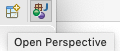

**Contents**
  \- [Eclipse](#eclipse)
  \- [Download and Install Eclipse](#download-and-install-eclipse)
  \- [Setup Eclipse for Python development](#setup-eclipse-for-python-development)
  \- [Set Anaconda as the Python interpreter](#set-anaconda-as-the-python-interpreter)
  \- [Create PyDev project](#create-pydev-project)
  \- [Create PyDev Package](#create-pydev-package)

## Eclipse

[Eclipse](http://www.eclipse.org) is "an open extensible IDE for anything and nothing in particular", where IDE stands for Integrated Development Environment. I use Eclipse for writing my Python scripts, and running Karttur´s Geo Imagine processing.

### Java Development Kit (JDK)

Dependent on your operating system and the version of <span class='app'>Eclipse</span>, you might have to install a Java Development Kit (JDK). You can go ahead and skip installing JDK at this point, but if your installation of <span class='app'>Eclipse</span> stops with a message like _To use Java command-line tools you need to install a JDK_, then have a look at the [post on Install Java Development Kit (JDK)](../../blog/install-JDK).

#### Eclipse and JDK compatibility

Some combinations of different versions of Eclipse and JDK are not compatible. Eclipse version 4.9 (2018-09) has issues with JDK version 10 and 11: there is a constant error reporting "An internal error occurred during: Polling news feeds". In the beginning you might think it is ok to click it away, but it gets very annoying after a while. I have searched for an alternative solution to this problem, but it seems it can not be bypassed without loosing other capabilities. You just have to choose another combination of JDK and Eclipse.

### Download and Install Eclipse

You can either download the default package of Eclipse via the [official homepage](http://www.eclipse.org), or choose a custom Eclipse version from the [package download page](http://www.eclipse.org/downloads/eclipse-packages/). The <span class='button'>Download</span> button on the official main page will redirect you to the [downloads](https://www.eclipse.org/downloads/) page and if you download you will get a smaller installating app. In Mac OSX that equals a disk image <span class='file'>dmg</span> file. If tou go to the [package download page](http://www.eclipse.org/downloads/eclipse-packages/) you will get the options option to **Try the Eclipse Installer YYYY‑MM R**, which links to the same download package. You can also download a [legacy version](https://www.eclipse.org/downloads/packages/release/), in which case you will again get the same options for selecting different Eclipse packages.

if you downloaded the Eclipse installer package, just open it (in Mac OSX just double click the <span class='file'>dmg</span>) file.

<figure>

<figcaption> {{ site.data.images[page.figure1].caption }} </figcaption>
</figure>

You might get a warning that the app is downloaded form the internet, just click that you accept or open the app in any case.

<figure>

<figcaption> {{ site.data.images[page.figure2].caption }} </figcaption>
</figure>

Regardless of how you choose to access Eclipse, it is enough to install the (small package) <span class='button'>Eclipse IDE for Java Developers</span> (not for EE Developers).

<figure>

<figcaption> {{ site.data.images[page.figure3].caption }} </figcaption>
</figure>

If you downloaded the small download app, it will directly create your Eclipse installation in the location of your choosing.

<figure>

<figcaption> {{ site.data.images[page.figure4].caption }} </figcaption>
</figure>

If you instead downloaded Eclipse (**not** the Eclipse Installer) as a package, you will receive another diskimage (<span class='file'>.dmg</span>). Double click the <span class ='file'>.dmg</span> file, and then just drag the <span class='file'>Eclipse.app</span> inside the diskimage to where you want it to reside.

<span class='app'>Eclipse</span> is a stand alone application, so you can put it anywhere. For instance under <span class='file'>./documents/"version"</span> which also allows you to have multiple <span class='app'>Eclipse</span> versions installed simultaneously.

### Setup Eclipse for Python development

Launch <span class ='app'>Eclipse</span>.

<figure>

<figcaption> {{ site.data.images[page.figure5].caption }} </figcaption>
</figure>

If this is the the first time you start <span class='app'>Eclipse</span>, the <span class='app'>Eclipse</span> <span class='tab'>Launcher</span> window will pop-up and prompt you to <span class='button'>Select a Directory</span> as workspace. You can accept the suggested default, or navigate to another place where you want to save the <span class='app'>Eclipse</span> workspace. As the different versions of <span class='app'>Eclipse</span> are not fully compatible, I have chosen to have different workspaces for different versions. With the workspace name set according to the version (e.g. "2020-03" for the version installed here).

<figure>

<figcaption> {{ site.data.images[page.figure6].caption }} </figcaption>
</figure>

Click <span class='button'>Launch</span> to continue. The next window is the <span class ='tab'>Eclipse Welcome</span>. It will present 10 or so alternatives (icons with text). From these you need to select <span class='tab'>Launch the Eclipse Marketplace</span>.

<figure>

<figcaption> {{ site.data.images[page.figure7].caption }} </figcaption>
</figure>

<span class='tab'>Eclipse Marketplace</span> opens in a separate window. The marketplace contains items for extending and customise <span class='app'>Eclipse</span>. You need to add the Python development (PyDev) environment. Write 'PyDev'in the search box and click the <span class='button'>Go</span> button to start searching. One of the top (or only) alternatives should be the 'PyDev - Python IDE ...' for the version of <span class='app'>Eclipse</span> you just installed.

<figure>

<figcaption> {{ site.data.images[page.figure8].caption }} </figcaption>
</figure>

Install the PyDev - Python IDE by clicking the <span class='button'>Install</span> button next to it. In the next window that appears (<span class='tab'>Confirm Selected Features</span>), <span class='button'>Confirm</span> the default selection (all suggested items).

<figure>

<figcaption> {{ site.data.images[page.figure9].caption }} </figcaption>
</figure>

In the then next window, <span class='textbox'>accept the terms of the licence agreement</span>, and click <span class='button'>Finish</span>.

<figure>

<figcaption> {{ site.data.images[page.figure10].caption }} </figcaption>
</figure>

Restart <span class='app'>Eclipse</span> to invoke the software updates. When you get to the Welcome screen the second time, after installing the PyDev - Python IDE, click the small workbench icon in the upper right corner.

### Set Anaconda as the Python interpreter

With <span class='app'>Eclipse</span> workbench up and running, select from the top menu:

<span class='menu'>Eclipse : preferences</span>

In the <span class='tab'>Preferences</span> window that opens, click the PyDev expansion icon (\>) in the menu to the left. In the expanded sub-list click the expansion icon for <span class='button'>Interpreters</span> and click <span class='button'>Python interpreter</span>.

<figure>

<figcaption> {{ site.data.images[page.figure12].caption }} </figcaption>
</figure>

In the window that opens, click the <span class='button'>Browse for python/pypy exe</span> button in the upper right corner. The dialog window <span class='tab'>Select Interpreters</span> opens.

#### Virtual environment python Interpreter

If you have setup a [Conda virtual environments](../conda-environ), the preferred method, click <span class='button'>Browse</span> button next to the textbox <span class='textbox'>Interpreter Executable</span>. Navigate to the virtual environment you created (e.g. .../anaconda3/envs/geoimagine001/bin/python) and choose that file. Then edit the textbox <span class='textbox'>Interpreter Name</span> to something like 'Python3.x geoimagine001'.

<figure>

<figcaption> {{ site.data.images[page.figure13].caption }} </figcaption>
</figure>

#### Anaconda base environment

If you did not setup a virtual Python environment you can use the Anaconda default (or 'base') environment as your Python interpreter. Click the <span class='button'>Browse</span> button and navigate to where you [installed Anaconda](../setting-up-anaconda/index.html), and drill down to the Python executable:

<span class='file'>.../anaconda3/bin/python</span>

### Apply the selected interpreter

Regardless of which interpreter you selected, click <span class='button'>Finish/OK</span>, and the dialog window <span class='tab'>Selection Needed</span> appears. Accept the default selection (all listed items), and click <span class='button'>Finish/OK</span> again. All the selected Libraries and their associated Packages will be linked to your project, and show up in the lower frame of the <span class='tab'>Preferences</span> window. When finished, click <span class='button'>Apply and Close</span>.

After the interpreter configuration is finished you will get back to the workbench main window and its panes.

<figure>

<figcaption> {{ site.data.images[page.figure14].caption }} </figcaption>
</figure>

The default Graphical User Interface (GUI) is for Java. You can either change it to PyDev manually or let <span class='app'>Eclipse</span> automatically detect that you want to run PyDev once you start building your project.


{: .pull-right}
To manually set the GUI environment to PyDev, click the small icon for _Open perspective_.
In the dialog window that opens, select _PyDev_.

<figure>

<figcaption> {{ site.data.images[page.figure15].caption }} </figcaption>
</figure>

The GUI will change to PyDev perspective and also add a small icon for this perspective in the top right corner.

<figure>

<figcaption> {{ site.data.images[page.figure16].caption }} </figcaption>
</figure>

### Create PyDev project

Eclipse projects can either be created from scratch, or from an existing resource. Here we will start from scratch. Go via the <span class='app'>Eclipse</span> main menu:

<span class='menu'>File : New : Project : PyDev project</span>

If you can only choose:

<span class='menu'>File : New : Project</span>

accept that, and then select PyDev Project in the <span class='tab'>New Project</span> window that opens.

In the <span class='tab'>PyDev Project</span> window enter a project name (e.g. myPyDevProj). You can accept all the default settings after making sure that the interpreter is set to the Anaconda Python version you defined as the interpreter above (should also be the default). When you click <span class='button'>Finish</span>, <span class='app'>Eclipse</span> will suggest that you shift to the PyDev perspective, accept the suggestion. When you return to the Workbench, the panes will change to the PyDev perspective.

### Create PyDev package

Make sure the created PyDev Project (myPyDevProj) is highlighted in the <span class='tab'>Navigation</span> pane (PyDev Package Explorer), and go via the <span class='app'>Eclipse</span> main menu to create a new PyDev Package:

<span class='menu'>File : New : PyDev Package</span>

In the <span class='tab'>Create a new Python package</span> window, give your package a name (for example 'myPackage'), and click <span class='button'>OK/Finish</span>. The dialog box for <span class='tab'>Default Eclipse preferences for PyDev</span> will pop up. Click OK to accept the default settings. A file called <span class='file'>\_\_init\_\_.py</span> is created in your PyDev Package.
The file <span class='file'>\_\_init\_\_.py</span> indicates that the folder (myPackage) is a Python package, even if <span class='file'>\_\_init\_\_.py</span> is completely empty.

With the package (myPackage) or the file <span class='file'>\_\_init\_\_.py</span> highlighted, create a sub-package via the <span class='app'>Eclipse</span> main menu:

<span class='menu'>File : New : PyDev Package</span>

In the dialog window <span class='tab'>Create a new Python package</span> that opens, you should see the name of your main package already filled (<span class='textbox'>'myPackage'</span>). To create a sub-package you should use Python syntax (rather than operating system syntax) and add a dot (.) followed by the name of the sub-package ('mySubPackage') (<span class='textbox'>myPackage.mySubPackage</span>).

Click <span class='button'>Finish</span> to create the sub-package ('mySubPackage'). Also the sub-package will be created with a file called <span class='file'>\_\_init\_\_.py</span> that is empty.

### Create Python module

Select 'myPackage.mySubPackage' by clicking on it the Navigator pane, then go via the <span class='app'>Eclipse</span> main menu to create a Python module:

<span class='menu'>File : New : PyDev Module</span>

In the dialog window <span class='tab'>Create a new Python module</span> the Source Folder should be your project (myPyDevProj), and the Package should be your package dot your sub-package (myPackage.mySubPackage). Also note that Python is case sensitive. Give your new module a <span class='textbox'>Name</span> ('myTestModule'), and click <span class='button'>Finish</span>. In the <span class='tab'>Template</span> window that opens, select \<Empty\> (default choice).

Click the empty <span class='file'>myTestModule.py</span> file in your sub-package that you created. The file will open in the central main pane. Write the following Python code:

```
def PrintTest():
    print ('Hello World!')
```
The indent is very important as Python interprets block of codes dependent on the level of indentation. You **must** use the tab key to indent the line "print ('Hello World!')". _def_ tells Python that the indented text below is a function, and you can call the function PrintTest() to perform the processes defined within it. To do that, add the following line, without indent, below the PrintTest() function:
```
PrintTest()
```
The complete file <span class='file'>myTestModule.py</span>  should then look like this:
```
def PrintTest():
    print ('Hello World!')

PrintTest()
```
Save the file, either by Command-S, or via the <span class='app'>Eclipse</span> main menu:

<span class='menu'>File : Save</span>

Execute (run) (myTestModule.py) from the <span class='app'>Eclipse</span> Main menu:

<span class='menu'>Run : Run : Python Run</span>

If everything is OK, a <span class='tab'>Console</span> pane will open at the bottom of the workbench, and say:
```
Hello World!
```

### Link Python packages

Navigate to the main package (myPackage) by clicking it in the <span class='tab'>Navigation</span> pane. Create a new python module (myMainModule.py), but this time select 'Module:Main' from the <span class='tab'>Template</span> window. The new <span class='file'>myMainModule.py</span> module will be created with some text added:

```
'''
Created on DD Month YYYY

@author: youruser
'''

if __name__ == '__main__':
    pass
```

The triple quotations \'\'\' indicates the start and end of a comment (part of the code that is ignored when the script is compiled and executed). Single lines can also be commented by using #. The word _pass_ indicates that nothing will be processed, but is needed to fill the indentation required by the Python interpreter.

Link your sub-package module by writing (or copy and paste) the following line after the commented block:
```
from myPackage.mySubPackage import myTestModule
```
and replace _pass_ (while keeping the indent) with the following code:
```
    myTestModule.PrintTest()
```

The complete file <span class='file'>myMainModule.py</span>  should then look like this:
```
'''
Created on DD Month YYYY

@author: youruser
'''
from myPackage.mySubPackage import myTestModule

if __name__ == '__main__':
    myTestModule.PrintTest()
```

Save the <span class='file'>myMainModule.py</span> file and run it. You should again see the text Hello World! in the console, but written twice:
```
Hello World!
Hello World!
```
The first time is from when you imported the module (__from myPackage.mySubPackage import myTestModule__), and the second time from when the \_\_main\_\_ part was executed.

<span class='app'>Eclipse</span> is up and running PyDev using the Anaconda Python distribution.

## Resources

[Eclipse](https://www.eclipse.org/)

[PyDev](http://www.pydev.org/)
